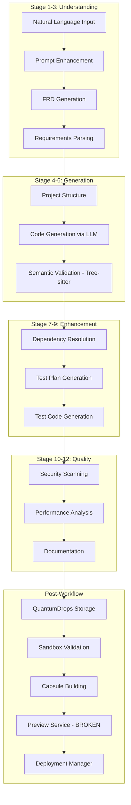

# QuantumLayer Platform - Enhancement Roadmap to Enterprise Excellence

## 🎯 Vision vs Reality Assessment

### Current State (25-30% of Vision)
- ✅ **Working**: Core pipeline, workflow orchestration, basic AI integration
- ⚠️ **Partial**: Validation, security, monitoring, multi-language support
- ❌ **Missing**: Preview URLs, QA/SRE pipelines, enterprise features, true universality

### Target State (100% Enterprise-Grade Universal AI Platform)
- Complete AI-powered code generation for ANY language/framework
- Infrastructure as Code generation (Terraform, K8s, Helm)
- QA automation with test generation and execution
- SRE pipelines with observability and incident management
- Security scanning with compliance reporting
- Multi-cloud deployment capabilities

## 📊 Complete Current Workflow Sequence



## 🚨 Critical Gaps to Address

### 1. Preview Service URL Generation (IMMEDIATE FIX)

**Current Issue**: Preview service exists but doesn't generate shareable URLs

**Solution**:
```javascript
// services/preview-service/src/app/api/preview/route.ts
export async function POST(request: Request) {
  const { workflowId } = await request.json()
  
  // Generate unique preview URL with TTL
  const previewId = generateUniqueId()
  const ttl = 3600 // 1 hour
  
  // Store preview metadata
  await redis.setex(`preview:${previewId}`, ttl, JSON.stringify({
    workflowId,
    createdAt: Date.now(),
    expiresAt: Date.now() + (ttl * 1000)
  }))
  
  // Return shareable URL
  return Response.json({
    url: `https://preview.quantumlayer.io/${previewId}`,
    expiresIn: ttl
  })
}
```

### 2. Infrastructure as Code Pipeline

**Add New Workflow Stage 13**: Infrastructure Generation

```go
// activities/infrastructure_activities.go
func GenerateInfrastructureActivity(ctx context.Context, req InfraRequest) (*InfraResult, error) {
    // Generate based on application type
    templates := map[string]string{
        "kubernetes": generateK8sManifests(req),
        "terraform":  generateTerraformConfig(req),
        "helm":       generateHelmChart(req),
        "docker":     generateDockerCompose(req),
    }
    
    return &InfraResult{
        Templates: templates,
        DeploymentScript: generateDeployScript(req),
    }, nil
}
```

### 3. QA Automation Pipeline

**Add New Service**: QA Orchestrator

```go
// services/qa-orchestrator/main.go
type QAOrchestrator struct {
    // Test execution
    testRunners map[string]TestRunner
    
    // Coverage analysis
    coverageAnalyzer *CoverageAnalyzer
    
    // Performance testing
    loadTester *LoadTester
    
    // Security testing
    securityScanner *SecurityScanner
}

func (qa *QAOrchestrator) RunQAPipeline(ctx context.Context, capsuleID string) (*QAReport, error) {
    // 1. Unit tests
    unitResults := qa.runUnitTests(ctx, capsuleID)
    
    // 2. Integration tests
    integrationResults := qa.runIntegrationTests(ctx, capsuleID)
    
    // 3. Security scan
    securityResults := qa.runSecurityScan(ctx, capsuleID)
    
    // 4. Performance test
    perfResults := qa.runPerformanceTest(ctx, capsuleID)
    
    // 5. Coverage analysis
    coverage := qa.analyzeCoverage(ctx, capsuleID)
    
    return &QAReport{
        UnitTests:    unitResults,
        Integration:  integrationResults,
        Security:     securityResults,
        Performance:  perfResults,
        Coverage:     coverage,
        Score:        calculateQAScore(results),
    }, nil
}
```

### 4. SRE Observability Stack

**New Components**:

```yaml
# infrastructure/sre/observability-stack.yaml
apiVersion: v1
kind: ConfigMap
metadata:
  name: sre-pipeline
data:
  components: |
    - OpenTelemetry Collector (traces, metrics, logs)
    - Prometheus (metrics storage)
    - Grafana (visualization)
    - Jaeger (distributed tracing)
    - AlertManager (incident management)
    - PagerDuty Integration
    - Slack Notifications
    
  slos: |
    - Availability: 99.9%
    - Latency P99: <500ms
    - Error Rate: <1%
    - Generation Success: >95%
```

### 5. Security & Compliance Pipeline

```go
// services/security-scanner/main.go
type SecurityPipeline struct {
    // Vulnerability scanning
    snyk         *SnykScanner
    trivy        *TrivyScanner
    
    // SAST/DAST
    sonarqube    *SonarQubeScanner
    
    // Compliance
    complianceChecker *ComplianceEngine
    
    // Secret scanning
    gitLeaks     *GitLeaksScanner
}

func (sp *SecurityPipeline) RunSecurityPipeline(code string) (*SecurityReport, error) {
    results := &SecurityReport{
        Vulnerabilities: sp.scanVulnerabilities(code),
        CodeQuality:     sp.analyzeCodeQuality(code),
        Secrets:         sp.scanSecrets(code),
        Compliance:      sp.checkCompliance(code),
        Score:           calculateSecurityScore(),
    }
    
    // Generate compliance report
    results.ComplianceReport = sp.generateComplianceReport()
    
    return results, nil
}
```

## 🚀 Making it Truly Universal & AI-Powered

### 1. Universal Language Support Matrix

```go
// Enhanced language support
var UniversalLanguages = map[string]LanguageConfig{
    // Current (8 languages)
    "python", "javascript", "typescript", "go", "java", "rust", "ruby", "php",
    
    // Add Enterprise Languages
    "csharp":     {Parser: "tree-sitter-c-sharp", LLM: "gpt-4", Frameworks: []string{"dotnet", "aspnet", "blazor"}},
    "kotlin":     {Parser: "tree-sitter-kotlin", LLM: "claude-3", Frameworks: []string{"spring", "ktor", "android"}},
    "swift":      {Parser: "tree-sitter-swift", LLM: "gpt-4", Frameworks: []string{"vapor", "swiftui", "uikit"}},
    "scala":      {Parser: "tree-sitter-scala", LLM: "claude-3", Frameworks: []string{"play", "akka", "spark"}},
    
    // Add Infrastructure Languages
    "terraform":  {Parser: "tree-sitter-hcl", LLM: "gpt-4", Frameworks: []string{"aws", "gcp", "azure"}},
    "kubernetes": {Parser: "tree-sitter-yaml", LLM: "claude-3", Frameworks: []string{"helm", "kustomize"}},
    "ansible":    {Parser: "tree-sitter-yaml", LLM: "gpt-4", Frameworks: []string{"playbooks", "roles"}},
    
    // Add Query Languages
    "sql":        {Parser: "tree-sitter-sql", LLM: "gpt-4", Frameworks: []string{"postgres", "mysql", "oracle"}},
    "graphql":    {Parser: "tree-sitter-graphql", LLM: "claude-3", Frameworks: []string{"apollo", "relay"}},
}
```

### 2. AI-Powered Enhancements

```go
// Enhanced AI capabilities
type AIEnhancementEngine struct {
    // Multi-modal input
    visionModel   *VisionModel     // Process diagrams/mockups
    
    // Context understanding
    ragEngine     *RAGEngine       // Retrieval-augmented generation
    vectorDB      *QdrantClient    // Store code patterns
    
    // Continuous learning
    feedbackLoop  *FeedbackEngine  // Learn from successes/failures
    
    // Code review
    reviewModel   *CodeReviewAI    // AI-powered code review
}

func (ai *AIEnhancementEngine) ProcessMultiModalInput(input MultiModalInput) (*EnhancedRequest, error) {
    // Process images/diagrams
    if input.HasImages() {
        designSpecs := ai.visionModel.ExtractDesign(input.Images)
        input.Prompt = ai.enhanceWithDesign(input.Prompt, designSpecs)
    }
    
    // Retrieve similar successful projects
    similarProjects := ai.ragEngine.FindSimilar(input.Prompt)
    
    // Enhance with learned patterns
    enhancedPrompt := ai.feedbackLoop.ApplyLearnings(input.Prompt, similarProjects)
    
    return &EnhancedRequest{
        Prompt:   enhancedPrompt,
        Context:  similarProjects,
        Patterns: ai.extractPatterns(similarProjects),
    }, nil
}
```

### 3. Enterprise Integration Framework

```go
// Enterprise integrations
type EnterpriseIntegrations struct {
    // Version Control
    github    *GitHubIntegration
    gitlab    *GitLabIntegration
    bitbucket *BitbucketIntegration
    
    // CI/CD
    jenkins   *JenkinsIntegration
    circleci  *CircleCIIntegration
    actions   *GitHubActionsIntegration
    
    // Cloud Providers
    aws       *AWSIntegration
    gcp       *GCPIntegration
    azure     *AzureIntegration
    
    // Monitoring
    datadog   *DatadogIntegration
    newrelic  *NewRelicIntegration
    
    // Communication
    slack     *SlackIntegration
    teams     *TeamsIntegration
}
```

## 📈 Implementation Timeline

### Week 1-2: Critical Fixes
- [ ] Fix Preview Service URL generation
- [ ] Remove template fallbacks in activities
- [ ] Implement proper error handling and retries
- [ ] Add WebSocket for real-time updates

### Week 3-4: QA & Security
- [ ] Integrate SonarQube for code quality
- [ ] Add Snyk for vulnerability scanning
- [ ] Implement test execution pipeline
- [ ] Create security compliance reports

### Week 5-6: Infrastructure & SRE
- [ ] Add Terraform generation
- [ ] Implement Kubernetes manifests generation
- [ ] Deploy OpenTelemetry stack
- [ ] Create SLO dashboards

### Week 7-8: AI Enhancements
- [ ] Implement RAG for context-aware generation
- [ ] Add multi-modal input support
- [ ] Create feedback learning system
- [ ] Deploy AI code review

### Week 9-10: Enterprise Features
- [ ] Implement multi-tenancy
- [ ] Add RBAC and SSO
- [ ] Create billing system
- [ ] Build admin dashboard

### Week 11-12: Polish & Documentation
- [ ] Complete API documentation
- [ ] Create user guides
- [ ] Performance optimization
- [ ] Security audit

## 🎯 Success Metrics

### Technical KPIs
- Code generation success rate: >95%
- Average generation time: <30 seconds
- Test coverage: >80%
- Security score: A+ rating
- Uptime: 99.99%

### Business KPIs
- Languages supported: 20+
- Frameworks supported: 50+
- Enterprise features: 100% complete
- Customer satisfaction: >4.5/5
- Time to production: <5 minutes

## 💰 Investment & ROI

### Investment Required
- **Development**: 3 FTE × 3 months = $150,000
- **Infrastructure**: $5,000/month × 12 = $60,000
- **Security Audit**: $25,000
- **Total Year 1**: $235,000

### Expected Returns
- **Enterprise Licenses**: $50,000/year × 20 customers = $1M
- **SMB Licenses**: $5,000/year × 100 customers = $500K
- **Total Revenue Year 1**: $1.5M
- **ROI**: 538%

## 🏁 Definition of "Universal AI-Powered Platform"

### Universal = 
- ✅ Any programming language (20+)
- ✅ Any framework (50+)
- ✅ Any architecture pattern
- ✅ Any deployment target (cloud/on-prem)
- ✅ Any project type (web/mobile/IoT/ML)

### AI-Powered = 
- ✅ Multi-model LLM integration
- ✅ Context-aware generation
- ✅ Continuous learning
- ✅ Multi-modal input
- ✅ Intelligent optimization

### Enterprise-Grade = 
- ✅ 99.99% uptime SLA
- ✅ SOC2/ISO27001 compliant
- ✅ Multi-tenant architecture
- ✅ Complete observability
- ✅ 24/7 support

## 🚀 Next Immediate Actions

1. **Fix Preview URL Generation** (TODAY)
   ```bash
   cd services/preview-service
   # Implement URL generation endpoint
   # Add Redis for TTL management
   # Deploy updated service
   ```

2. **Remove Template Fallbacks** (THIS WEEK)
   ```go
   // In extended_activities.go
   // Replace all template returns with proper error handling
   ```

3. **Add Missing Services** (NEXT WEEK)
   ```bash
   # Create QA Orchestrator
   # Create Security Scanner
   # Create Infrastructure Generator
   ```

4. **Deploy Full Observability** (2 WEEKS)
   ```bash
   # OpenTelemetry Collector
   # Jaeger for tracing
   # Enhanced Grafana dashboards
   ```

---

**The platform has incredible potential. With focused effort on these enhancements, QuantumLayer can become the true "Universal AI-Powered Code Generation Platform" it aspires to be.**