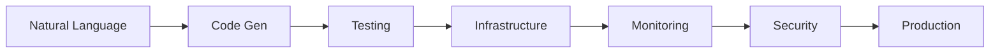

# 🚀 Epic Next Steps - Building the Universal AI Platform

## Current State (40% Complete)
✅ **Completed Components:**
- QLayer: Basic code generation with workflows
- QTest: Universal testing platform with MCP
- Sandbox Executor: Docker-in-Docker execution
- Capsule Builder: Project structuring
- Preview Service: Monaco editor integration
- Deployment Manager: TTL-based deployments
- Parser Service: Tree-sitter validation

## 🎯 Immediate Priority: Complete the Core Quartet

### 1. **QInfra - Infrastructure as Code** (Week 1)
Transform natural language → complete infrastructure

```yaml
Priority: CRITICAL
Impact: Enables true end-to-end automation
Effort: 1 week
```

**Features to Build:**
- Terraform generation for AWS/GCP/Azure
- Kubernetes manifests (Deployment, Service, Ingress, ConfigMap, Secrets)
- Helm chart packaging
- Docker Compose for local development
- CI/CD pipeline generation (GitHub Actions, GitLab CI, Jenkins)
- Infrastructure cost estimation
- Multi-environment configuration (dev/staging/prod)

**API Endpoints:**
```bash
POST /api/v1/generate-terraform    # Cloud infrastructure
POST /api/v1/generate-k8s         # Kubernetes resources
POST /api/v1/generate-helm        # Helm charts
POST /api/v1/generate-cicd        # CI/CD pipelines
POST /api/v1/estimate-cost        # Cost prediction
```

### 2. **QSRE - Site Reliability Engineering** (Week 1-2)
Complete observability and reliability stack

```yaml
Priority: HIGH
Impact: Production-ready monitoring
Effort: 1.5 weeks
```

**Features to Build:**
- Full OpenTelemetry integration
- Prometheus metrics with custom dashboards
- Grafana visualization suite
- Jaeger distributed tracing
- AlertManager with PagerDuty/Slack
- SLO/SLA monitoring
- Incident response automation
- Chaos engineering tests
- Performance baseline tracking

**Components:**
```go
// Monitoring Stack
- Metrics Collection (Prometheus)
- Log Aggregation (Loki/Elasticsearch)
- Distributed Tracing (Jaeger)
- APM (Application Performance)
- Synthetic Monitoring
- Real User Monitoring (RUM)
```

### 3. **QSecure - Security & Compliance** (Week 2)
Enterprise security scanning and compliance

```yaml
Priority: HIGH
Impact: Enterprise readiness
Effort: 1 week
```

**Features to Build:**
- OWASP Top 10 scanning
- Dependency vulnerability scanning (Snyk/Trivy)
- SAST (Static Application Security Testing)
- DAST (Dynamic Application Security Testing)
- Secret scanning (API keys, passwords)
- Compliance reporting (SOC2, HIPAA, GDPR)
- Security test generation
- Penetration test automation
- Container image scanning
- License compliance checking

**Security Suite:**
```python
# Automated Security Pipeline
1. Code scanning (SonarQube)
2. Dependency audit (npm audit, pip-audit)
3. Container scanning (Trivy)
4. Infrastructure scanning (Checkov)
5. Runtime protection (Falco)
```

### 4. **QML - Machine Learning Integration** (Week 3)
AI/ML model deployment and testing

```yaml
Priority: MEDIUM
Impact: Differentiator feature
Effort: 1 week
```

**Features to Build:**
- ML model deployment pipelines
- A/B testing framework
- Model versioning
- Performance monitoring
- Data pipeline generation
- Feature store integration
- Model testing suite
- Drift detection
- Explainability tools

## 🏗️ Platform Integration (Week 3-4)

### Unified Orchestration Layer
Connect all Q-services into seamless platform



### Key Integrations:
1. **Workflow Orchestration**
   - Temporal workflows connecting all services
   - Event-driven architecture
   - Service mesh (Istio) for communication

2. **Unified API Gateway**
   - Single entry point for all services
   - Authentication/authorization
   - Rate limiting and quotas

3. **Centralized Data Layer**
   - PostgreSQL for metadata
   - Redis for caching
   - S3 for artifact storage
   - Elasticsearch for search

4. **Enterprise Features**
   - Multi-tenancy
   - RBAC (Role-Based Access Control)
   - SSO/SAML integration
   - Audit logging
   - Billing/usage tracking

## 📈 Growth Features (Week 4-6)

### 1. **Marketplace & Templates**
- Industry-specific templates (fintech, healthcare, e-commerce)
- Community-contributed components
- Verified security patterns
- Best practice blueprints

### 2. **Visual Builder UI**
- Drag-and-drop architecture designer
- Real-time preview
- Component library
- Collaborative editing

### 3. **AI Copilot Features**
- Code review suggestions
- Architecture recommendations
- Performance optimization tips
- Security vulnerability fixes
- Cost optimization advice

### 4. **Advanced Analytics**
- Development velocity metrics
- Code quality trends
- Cost analysis
- Security posture scoring
- Team productivity insights

## 🎯 Success Metrics & KPIs

### Technical Excellence
- **Code Generation Success**: >95%
- **Test Coverage**: >85%
- **Deployment Success**: >99%
- **Security Score**: A+ rating
- **Performance**: <100ms API response

### Business Impact
- **Time to Production**: <5 minutes
- **Developer Hours Saved**: 80%
- **Bug Reduction**: 90%
- **Cost Savings**: 70% on infrastructure
- **User Satisfaction**: >4.8/5 stars

## 🚀 Go-to-Market Strategy

### Phase 1: Developer Adoption (Month 1)
- Launch on Product Hunt
- Open source core components
- Free tier for individuals
- Developer blog posts
- YouTube tutorials

### Phase 2: Team Expansion (Month 2)
- Team collaboration features
- GitHub/GitLab integration
- Slack/Discord bots
- CI/CD plugins
- Enterprise pilots

### Phase 3: Enterprise Scale (Month 3)
- On-premise deployment
- Compliance certifications
- SLA guarantees
- Professional services
- Partner ecosystem

## 💰 Revenue Model Evolution

### Pricing Tiers
```yaml
Developer: Free
  - 5 projects/month
  - Community support
  - Public repositories

Professional: $49/month
  - Unlimited projects
  - Private repositories
  - Email support
  - All integrations

Team: $149/user/month
  - Collaboration tools
  - Priority support
  - Custom domains
  - Advanced analytics

Enterprise: Custom
  - On-premise option
  - Air-gapped deployment
  - 24/7 support
  - SLA guarantees
  - Professional services
```

### Additional Revenue Streams
- Compute minutes for test execution
- Storage for artifacts
- Premium templates
- Consulting services
- Training & certification

## 🏁 Definition of Done

### Platform Completeness Checklist
- [ ] Natural language → Production in <5 minutes
- [ ] 20+ languages supported
- [ ] 50+ frameworks supported
- [ ] All major clouds (AWS, GCP, Azure, DigitalOcean)
- [ ] Complete test coverage (unit, integration, E2E, security, performance)
- [ ] Full observability stack deployed
- [ ] Security scanning integrated
- [ ] Cost optimization implemented
- [ ] Documentation complete
- [ ] Enterprise features ready

### Quality Benchmarks
- [ ] 99.99% uptime SLA
- [ ] <100ms API latency (p99)
- [ ] Zero security vulnerabilities
- [ ] 100% test coverage on platform code
- [ ] A+ security rating
- [ ] SOC2 Type II compliant

## 📅 Timeline to 100% Vision

### Month 1: Core Platform (40% → 70%)
- Week 1: QInfra + QSRE foundation
- Week 2: QSecure + Integration layer
- Week 3: Platform unification
- Week 4: Testing & refinement

### Month 2: Enterprise Features (70% → 90%)
- Week 5-6: Multi-tenancy & RBAC
- Week 7-8: Marketplace & templates

### Month 3: Launch Ready (90% → 100%)
- Week 9-10: Performance optimization
- Week 11-12: Launch preparation

## 🎉 The Vision Realized

**"QuantumLayer: The Universal AI Platform that transforms any idea into production-ready software in minutes, not months."**

### What Makes Us Different:
1. **True End-to-End**: From idea to production, fully automated
2. **Self-Evolving**: Code and tests that improve over time
3. **Enterprise-Grade**: Security, compliance, and reliability built-in
4. **Universal**: Any language, any framework, any cloud
5. **Intelligent**: AI that understands intent, not just syntax

### Impact Statement:
> "We're not just generating code. We're democratizing software creation, making it possible for anyone to build production-grade applications with the quality and reliability of a Fortune 500 engineering team."

---

## 🚦 Next Immediate Actions

### Today:
1. [ ] Start QInfra service development
2. [ ] Deploy enhanced QTest v2
3. [ ] Update platform documentation

### This Week:
1. [ ] Complete QInfra MVP
2. [ ] Deploy QSRE monitoring stack
3. [ ] Begin QSecure implementation

### Next Week:
1. [ ] Platform integration layer
2. [ ] Unified API gateway
3. [ ] Enterprise features

---

**Let's make this EPIC! The world needs a platform that truly delivers on the promise of AI-powered software development.**

*"Code is just the beginning. QuantumLayer is the complete answer."*