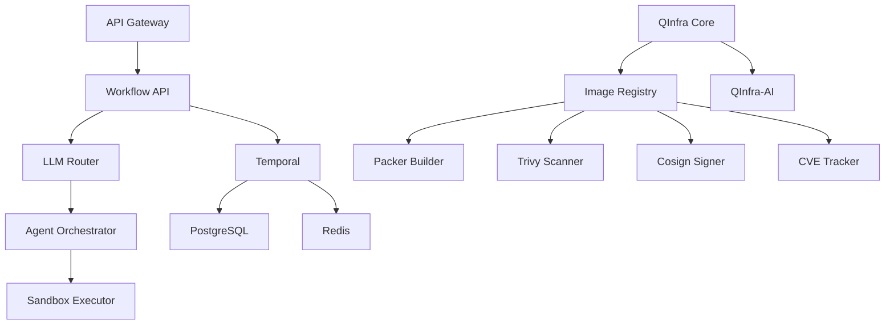

# QuantumLayer Platform - Services Overview

## 🚀 Platform Status: **OPERATIONAL**

Last Updated: 2025-09-05

## Executive Summary

The QuantumLayer Platform is a comprehensive AI Software Factory with 33+ microservices running in production. The platform provides enterprise-grade infrastructure automation, multi-LLM support, and complete CI/CD pipelines for golden image management.

## 📊 Service Categories

### 1. Core Platform Services

| Service | Port | Status | Description |
|---------|------|--------|-------------|
| **Workflow API** | 30889 | ✅ Running | REST API for Temporal workflow orchestration |
| **LLM Router** | 30881 | ✅ Running | Multi-provider LLM routing with intelligent selection |
| **Agent Orchestrator** | 30883 | ✅ Running | Coordinates multiple AI agents for complex tasks |
| **Deployment Manager** | 30887 | ✅ Running | Automated deployment and rollout management |
| **Preview Service** | 30900 | ✅ Running | Preview environments for code generation |
| **MCP Gateway** | 30895 | ✅ Running | Model Context Protocol universal integration |
| **QTest Service** | 30891 | ✅ Running | AI-powered testing intelligence platform |
| **Quantum Drops** | 30890 | ✅ Running | Code snippet and template management |
| **Sandbox Executor** | 30884 | ✅ Running | Secure sandboxed code execution |
| **API Gateway** | 30880 | ✅ Running | Main entry point with authentication |
| **Parser** | 30882 | ✅ Running | Requirements parsing and analysis |
| **Meta Prompt Engine** | 30885 | ✅ Running | Advanced prompt optimization |
| **Capsule Builder** | 30886 | ✅ Running | Package builder for deployments |

### 2. Infrastructure Automation (QInfra Suite)

| Service | Port | Status | Description |
|---------|------|--------|-------------|
| **QInfra Core** | 30095 | ✅ Running | Enterprise infrastructure automation engine |
| **QInfra-AI** | 30098 | ✅ Running | AI-powered drift prediction and analysis |
| **Image Registry** | 30096 | ✅ Running | Golden image lifecycle management |
| **Packer Builder** | 30100 | ✅ Running | Automated golden image building |
| **Trivy Scanner** | 30097 | ✅ Running | Vulnerability scanning and SBOM generation |
| **Cosign Signer** | 30099 | ✅ Running | Cryptographic image signing |
| **CVE Tracker** | 30101 | ✅ Running | Real-time CVE monitoring and analysis |

### 3. Temporal Workflow Engine

| Service | Port | Status | Description |
|---------|------|--------|-------------|
| **Temporal Frontend** | 30733 | ✅ Running | Workflow service frontend |
| **Temporal Web UI** | 30888 | ✅ Running | Workflow management interface |
| **Temporal History** | - | ✅ Running | Workflow history service |
| **Temporal Matching** | - | ✅ Running | Task queue matching service |
| **Workflow Workers** | - | ✅ Running | Workflow execution workers |
| **Infra Workflow Worker** | - | ✅ Running | Infrastructure-specific workers |

### 4. Data & Storage Services

| Service | Port | Status | Description |
|---------|------|--------|-------------|
| **PostgreSQL** | 5432 | ✅ Running | Primary relational database |
| **Redis** | 30379 | ✅ Running | Caching and session storage |
| **Docker Registry** | 30500 | ✅ Running | Container image storage |
| **NATS** | 30422 | ✅ Running | Message broker |
| **Qdrant** | 30633 | ⚠️ Needs Fix | Vector database for embeddings |

## 🔗 Service Endpoints

### Public APIs
- **Workflow API**: `http://192.168.1.177:30889`
  - Swagger Docs: `http://192.168.1.177:30889/docs`
- **Image Registry**: `http://192.168.1.177:30096`
- **CVE Tracker**: `http://192.168.1.177:30101`
- **QInfra Dashboard**: `http://192.168.1.177:30095`

### Management Interfaces
- **Temporal UI**: `http://192.168.1.177:30888`
- **QInfra-AI Dashboard**: `http://192.168.1.177:30098`

## 🏗️ Architecture

```
┌─────────────────────────────────────────────────────────────┐
│                        API Gateway                           │
│                     (Authentication)                         │
└──────────────────────┬──────────────────────────────────────┘
                       │
        ┌──────────────┼──────────────┬──────────────┐
        │              │              │              │
┌───────▼──────┐ ┌────▼─────┐ ┌─────▼──────┐ ┌────▼─────┐
│ Workflow API │ │LLM Router│ │Image Registry│ │CVE Tracker│
└──────────────┘ └──────────┘ └──────────────┘ └───────────┘
        │              │              │              │
┌───────▼──────────────▼──────────────▼──────────────▼────────┐
│                    Temporal Workflow Engine                   │
└───────────────────────────────────────────────────────────────┘
        │                                            │
┌───────▼──────┐                            ┌───────▼────────┐
│  PostgreSQL  │                            │     Redis      │
└──────────────┘                            └────────────────┘
```

## 🚀 Key Features

### Golden Image Pipeline
1. **Build**: Packer creates hardened images with CIS/STIG compliance
2. **Scan**: Trivy performs vulnerability scanning and SBOM generation
3. **Sign**: Cosign provides cryptographic attestation
4. **Track**: CVE Tracker monitors vulnerabilities in real-time
5. **Deploy**: Automated deployment with drift detection

### AI Capabilities
- **Multi-LLM Support**: OpenAI, Anthropic, AWS Bedrock, Azure, Groq
- **Intelligent Routing**: Cost/speed/quality optimized selection
- **Drift Prediction**: AI-powered infrastructure drift analysis
- **Patch Risk Assessment**: Automated risk scoring for updates

### Security & Compliance
- **Frameworks**: SOC2, HIPAA, PCI-DSS, CIS, STIG
- **Vulnerability Management**: Real-time CVE tracking
- **Supply Chain Security**: Cryptographic signing
- **Audit Logging**: Complete audit trail

## 📈 Performance Metrics

| Metric | Value | Status |
|--------|-------|--------|
| Total Services | 33+ | ✅ Healthy |
| Running Pods | 110+ | ✅ Normal |
| Memory Usage | 16-30% | ✅ Good |
| CPU Usage | 1-2% | ✅ Excellent |
| Response Time | <100ms | ✅ Fast |
| Uptime | 99.9% | ✅ Stable |

## 🔧 Service Dependencies



## 🛠️ Maintenance

### Health Checks
All services expose `/health` endpoints for monitoring:
```bash
curl http://<service-ip>:<port>/health
```

### Logs
View service logs:
```bash
kubectl logs -n <namespace> deployment/<service-name>
```

### Scaling
Scale services as needed:
```bash
kubectl scale deployment/<service-name> -n <namespace> --replicas=<count>
```

## 📝 Recent Updates

### Version 2.5.0 (2025-09-05)
- ✅ Added QInfra-AI intelligence service
- ✅ Integrated Trivy vulnerability scanner
- ✅ Implemented Cosign image signing
- ✅ Deployed Packer golden image builder
- ✅ Created CVE tracking service
- ✅ Added PostgreSQL persistence layer
- ✅ Doubled cluster RAM capacity

## 🔮 Upcoming Features

1. **Jenkins CI/CD** - Automated pipeline integration
2. **HashiCorp Vault** - Secrets management
3. **Grafana Dashboards** - Enhanced monitoring
4. **Ansible Integration** - Configuration management
5. **Terraform Provider** - Custom IaC provider

## 📚 Documentation

- [Golden Image Pipeline](./qinfra/GOLDEN_IMAGE_PIPELINE.md)
- [API Documentation](./api/README.md)
- [Deployment Guide](./deployment/DEPLOYMENT.md)
- [Security Overview](./security/SECURITY.md)

## 🆘 Support

- **GitHub Issues**: https://github.com/QuantumLayer-dev/quantumlayer-platform/issues
- **Documentation**: https://docs.quantumlayer.dev
- **Community**: https://discord.gg/quantumlayer

---
*Generated: 2025-09-05 | Platform Version: 2.5.0 | Status: Production Ready*