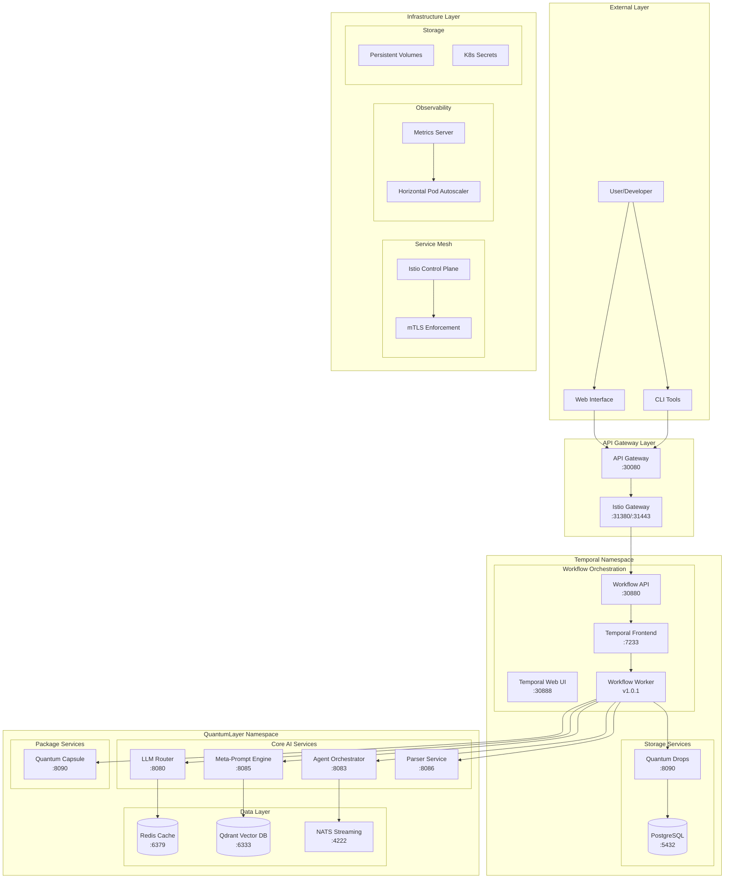
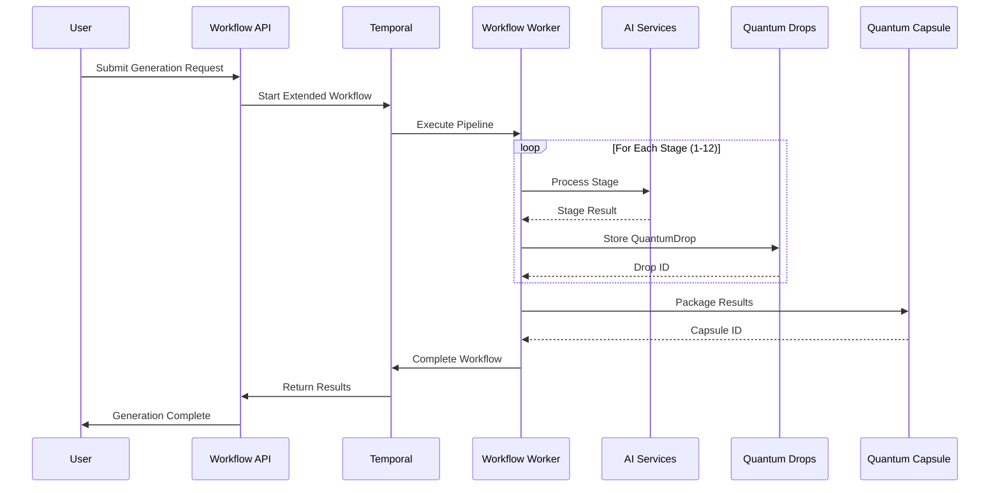
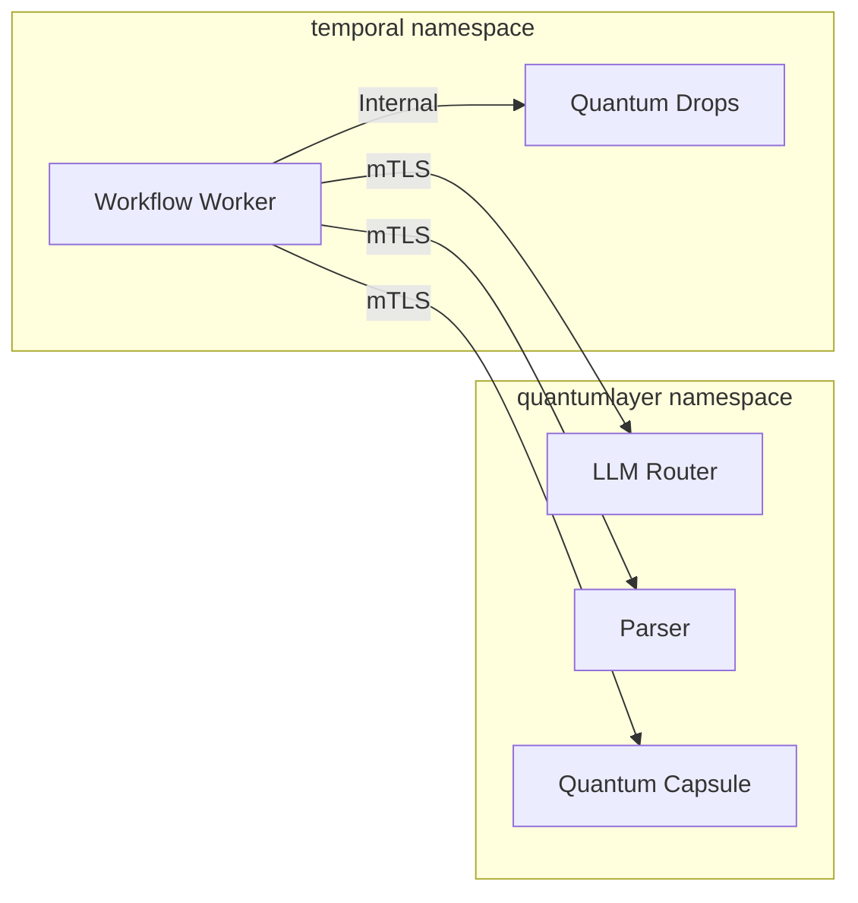
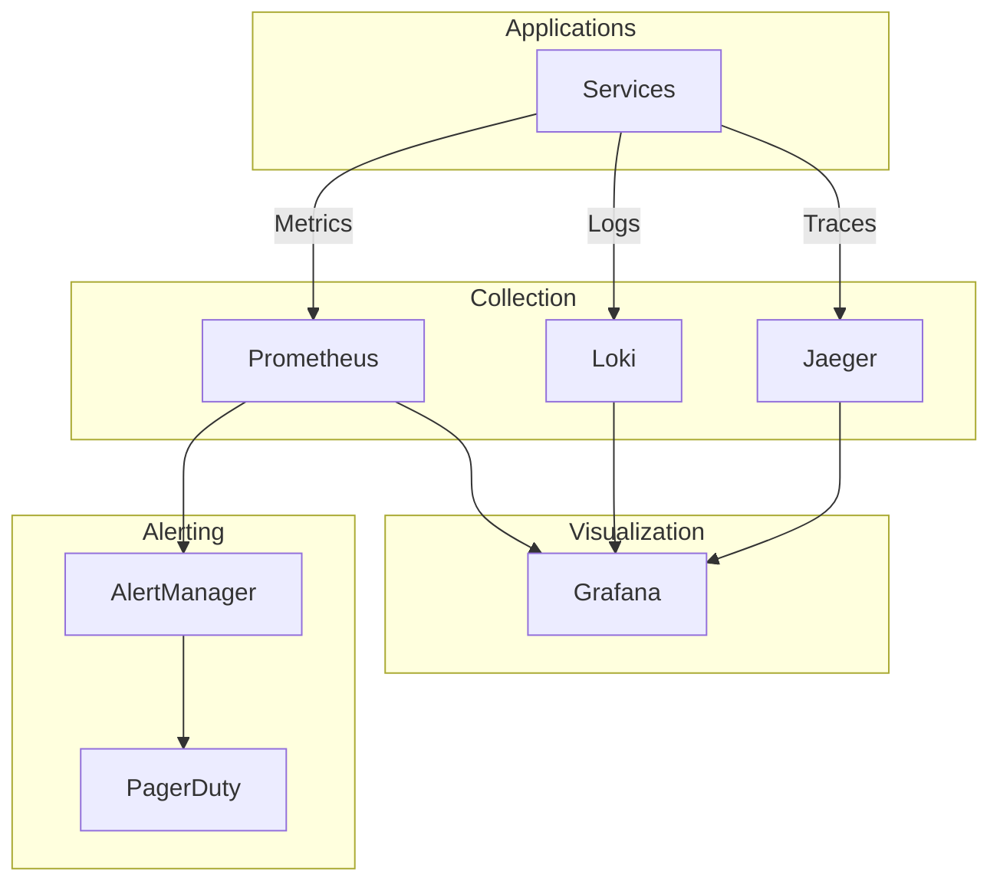
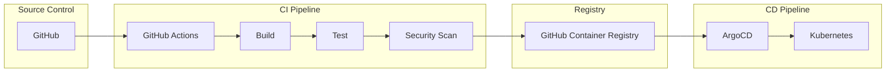
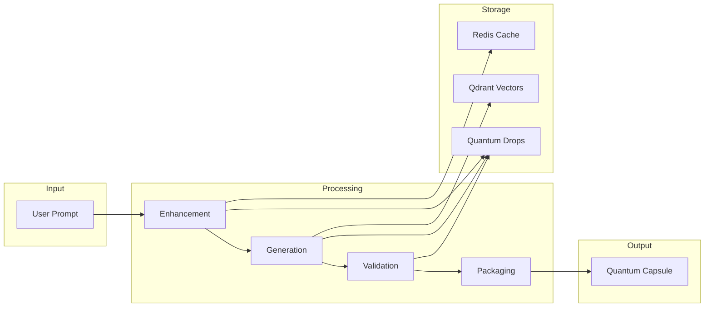

# QuantumLayer Platform - Current Architecture
*Last Updated: 2025-09-03*

## 🏗️ System Architecture Overview

The QuantumLayer platform implements a sophisticated microservices architecture for enterprise-grade AI code generation, featuring a 12-stage extended workflow pipeline with comprehensive validation, testing, and packaging capabilities.



## 🔄 12-Stage Extended Workflow Pipeline

### Workflow Architecture



### Pipeline Stages Detail

| Stage | Service | Function | Output |
|-------|---------|----------|--------|
| 1. Prompt Enhancement | Meta-Prompt Engine | Optimize and enrich prompt | Enhanced prompt |
| 2. FRD Generation | LLM Router | Create functional requirements | FRD document |
| 3. Requirements Parsing | Parser Service | Extract structured data | Parsed requirements |
| 4. Project Structure | LLM Router | Generate folder structure | Directory tree |
| 5. Code Generation | LLM Router | Generate implementation | Source code |
| 6. Semantic Validation | Parser Service | Validate with tree-sitter | AST & issues |
| 7. Dependency Resolution | LLM Router | Identify dependencies | Package list |
| 8. Test Plan Generation | LLM Router | Create test strategy | Test plan |
| 9. Test Generation | LLM Router | Generate test code | Test files |
| 10. Security Scanning | Parser Service | Basic vulnerability scan | Security report |
| 11. Performance Analysis | Parser Service | Analyze complexity | Performance metrics |
| 12. Documentation | LLM Router | Generate README & docs | Documentation |

## 🏢 Service Architecture

### Core Services

#### 1. Workflow Orchestration (Temporal Namespace)
- **Temporal Server**: Workflow engine managing execution
- **Workflow API**: REST interface for workflow submission
- **Workflow Worker**: Executes 12-stage pipeline activities
- **Configuration**: 
  - Task Queue: `code-generation`
  - Namespace: `quantumlayer`
  - Worker Count: 2 replicas

#### 2. AI Services (QuantumLayer Namespace)

**LLM Router** (v1.0.0)
- Multi-provider support (Azure OpenAI, AWS Bedrock, Groq)
- Load balancing and failover
- Response caching via Redis
- Endpoints: `/generate`, `/stream`

**Meta-Prompt Engine** (v1.0.0)
- Prompt optimization and enhancement
- Context injection
- Template management
- Vector similarity search via Qdrant

**Parser Service** (v1.0.0)
- Tree-sitter based semantic validation
- Multi-language AST parsing
- Code quality metrics
- Security vulnerability detection

**Agent Orchestrator** (v1.0.0)
- Multi-agent coordination
- Task decomposition
- Result aggregation
- Event streaming via NATS

#### 3. Storage Services

**Quantum Drops** (v1.0.0)
- Intermediate artifact storage
- PostgreSQL backend
- Workflow stage tracking
- Metadata management
- Schema:
  ```sql
  CREATE TABLE quantum_drops (
      id VARCHAR(255) PRIMARY KEY,
      workflow_id VARCHAR(255),
      stage VARCHAR(100),
      timestamp TIMESTAMP,
      artifact TEXT,
      type VARCHAR(50),
      metadata JSONB
  );
  ```

**Quantum Capsule** (v1.0.0)
- Self-contained package creation
- Tar.gz compression
- Manifest generation
- Dependency bundling

### Data Layer

#### PostgreSQL (v15)
- Primary database for Temporal
- Quantum Drops storage
- Connection pooling: pgbouncer (planned)
- Backup strategy: Daily snapshots (planned)

#### Redis (v7.2)
- LLM response caching
- Session management
- Pub/Sub messaging
- Persistence: AOF enabled

#### Qdrant (v1.7.4)
- Vector embeddings storage
- Similarity search
- Prompt template indexing
- Collections: `prompts`, `code_samples`

#### NATS (v2.10)
- Event streaming
- Service communication
- JetStream enabled
- Store directory: `/data`

## 🔒 Security Architecture

### Network Security

```yaml
Service Mesh: Istio
- mTLS: STRICT mode
- Authorization Policies: Defined
- Network Policies: Basic implementation
- Ingress Gateway: Configured
```

### Cross-Namespace Communication



### Authentication & Authorization
- **Secrets Management**: Kubernetes Secrets
- **API Keys**: Stored in `llm-credentials` secret
- **Service Accounts**: Per-service RBAC
- **Network Policies**: Namespace isolation

## 🚀 Deployment Architecture

### Container Registry
```
Registry: ghcr.io/quantumlayer-dev/
Images:
- workflow-api:v1.0.0
- workflow-worker:v1.0.1
- llm-router:v1.0.0
- parser:v1.0.0
- meta-prompt-engine:v1.0.0
- agent-orchestrator:v1.0.0
- quantum-drops:v1.0.0
- quantum-capsule:v1.0.0
```

### Resource Allocation

| Service | Replicas | CPU Request | Memory Request | CPU Limit | Memory Limit |
|---------|----------|-------------|----------------|-----------|--------------|
| Temporal Frontend | 1 | 100m | 128Mi | 500m | 512Mi |
| Workflow Worker | 2 | 200m | 512Mi | 1000m | 2Gi |
| LLM Router | 3 | 200m | 512Mi | 1000m | 2Gi |
| Parser | 2 | 100m | 256Mi | 500m | 1Gi |
| Others | 2 | 100m | 128Mi | 500m | 512Mi |

### Scaling Strategy
- **HPA Enabled**: CPU/Memory based
- **Metrics Server**: Deployed
- **Target Utilization**: 70% CPU
- **Min/Max Replicas**: 2/10

## 📊 Monitoring & Observability

### Current State
- **Metrics**: Metrics Server deployed
- **Logging**: kubectl logs (basic)
- **Tracing**: Not implemented
- **Dashboards**: Not available

### Planned Architecture


## 🔄 CI/CD Architecture (Planned)



## 🌐 Network Architecture

### Service Discovery
```
Internal DNS: cluster.local
Namespaces:
- quantumlayer.svc.cluster.local
- temporal.svc.cluster.local
```

### Exposed Services
| Service | Type | Internal Port | NodePort | URL |
|---------|------|---------------|----------|-----|
| Temporal UI | NodePort | 8080 | 30888 | http://192.168.1.177:30888 |
| Workflow API | NodePort | 8080 | 30880 | http://192.168.1.177:30880 |
| API Gateway | NodePort | 8080 | 30080 | http://192.168.1.177:30080 |

### Istio Configuration
```yaml
PeerAuthentication:
  mode: STRICT
  namespaces:
    - quantumlayer
    - temporal
    
DestinationRules:
  - Cross-namespace mTLS
  - Service-level policies
  
VirtualServices:
  - API routing
  - Traffic management
```

## 🔧 Configuration Management

### Environment Configuration
```
ConfigMaps:
- service-config: Application settings
- istio-config: Service mesh settings

Secrets:
- llm-credentials: Provider API keys
- postgres-postgresql: Database credentials
- ghcr-secret: Registry credentials
```

### Feature Flags (Planned)
- LaunchDarkly integration
- Runtime configuration
- A/B testing support

## 📦 Package Structure

```
quantumlayer-platform/
├── packages/
│   ├── workflows/         # Temporal workflows
│   ├── api/              # API services
│   ├── parser/           # Parser service
│   ├── llm-router/       # LLM routing
│   ├── meta-prompt/      # Prompt optimization
│   ├── agent-orchestrator/# Multi-agent
│   ├── quantum-drops/    # Artifact storage
│   └── quantum-capsule/  # Package management
├── infrastructure/
│   ├── kubernetes/       # K8s manifests
│   ├── helm/            # Helm charts
│   └── istio/           # Service mesh
├── docs/
│   ├── architecture/    # Architecture docs
│   ├── api/            # API documentation
│   └── status/         # Platform status
└── scripts/            # Deployment scripts
```

## 🎯 Architecture Principles

1. **Microservices**: Loosely coupled, independently deployable
2. **Event-Driven**: Asynchronous communication where appropriate
3. **Cloud-Native**: Kubernetes-first design
4. **Scalable**: Horizontal scaling with HPA
5. **Resilient**: Circuit breakers, retries, timeouts
6. **Observable**: Metrics, logs, traces (in progress)
7. **Secure**: Zero-trust, mTLS, secrets management
8. **Extensible**: Plugin architecture for new capabilities

## 🔄 Data Flow Architecture



## 📈 Performance Architecture

### Caching Strategy
- **L1 Cache**: In-memory (application level)
- **L2 Cache**: Redis (distributed)
- **L3 Cache**: CDN (planned)

### Load Balancing
- **Service Level**: Kubernetes service LB
- **Ingress Level**: Istio Gateway
- **Application Level**: Circuit breakers

### Database Optimization
- **Connection Pooling**: PgBouncer (planned)
- **Read Replicas**: PostgreSQL streaming (planned)
- **Partitioning**: Time-based for quantum_drops

## 🚨 Disaster Recovery Architecture (Planned)

### Backup Strategy
- **Database**: Daily snapshots, PITR
- **Code**: Git repository
- **Configurations**: GitOps backup
- **Volumes**: Velero snapshots

### Recovery Targets
- **RTO**: 4 hours
- **RPO**: 1 hour
- **Availability**: 99.9% SLA

## 📊 Capacity Planning

### Current Capacity
- **Concurrent Workflows**: 10
- **Requests/Second**: 50
- **Storage**: 100GB
- **Network**: 1Gbps

### Target Capacity
- **Concurrent Workflows**: 100
- **Requests/Second**: 500
- **Storage**: 10TB
- **Network**: 10Gbps

---

**Note**: This architecture document represents the current implementation state as of 2025-09-03. Regular updates will be made as the platform evolves toward production readiness.