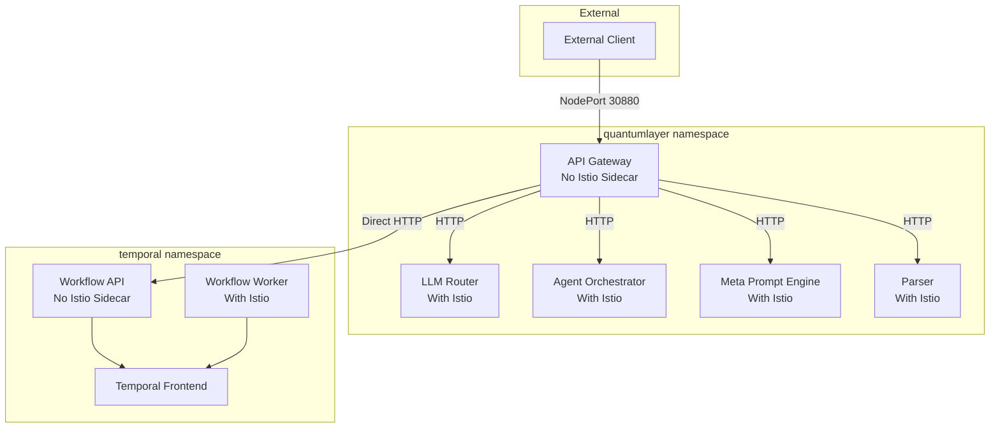

# QuantumLayer Platform - Production Architecture

## Overview
This document describes the production-grade architecture implemented for the QuantumLayer platform, focusing on proper service mesh configuration and cross-namespace communication.

## Key Architectural Decisions

### 1. Istio Service Mesh Configuration

#### Edge Services (No Sidecar)
The following services operate **without** Istio sidecar injection as they are edge services:

- **API Gateway** (`quantumlayer` namespace)
  - Entry point for external traffic
  - Handles HTTP routing and proxying
  - Direct connections to backend services
  - Annotation: `sidecar.istio.io/inject: "false"`

- **Workflow API** (`temporal` namespace)
  - Directly called by API Gateway
  - Interfaces with Temporal workflow engine
  - Annotation: `sidecar.istio.io/inject: "false"`

#### Internal Services (With Sidecar)
Internal services that communicate within the mesh should have Istio sidecars for:
- mTLS encryption
- Traffic management
- Observability

### 2. Cross-Namespace Communication

The platform uses explicit cross-namespace service URLs:

```yaml
# API Gateway environment variables
WORKFLOW_API_URL: "http://workflow-api.temporal.svc.cluster.local:8080"
LLM_ROUTER_URL: "http://llm-router.quantumlayer.svc.cluster.local:8080"
AGENT_ORCHESTRATOR_URL: "http://agent-orchestrator.quantumlayer.svc.cluster.local:8083"
META_PROMPT_ENGINE_URL: "http://meta-prompt-engine.quantumlayer.svc.cluster.local:8085"
PARSER_URL: "http://parser.quantumlayer.svc.cluster.local:8086"
```

### 3. Service Discovery Pattern

```
<service-name>.<namespace>.svc.cluster.local:<port>
```

This ensures reliable service discovery across namespaces.

## Deployment Architecture



## Current Status

### ✅ Working Components
1. **API Gateway**
   - Health endpoint: `http://<node-ip>:30880/health`
   - Successfully proxying requests to backend services
   - No Istio sidecar interference

2. **Workflow API**
   - Successfully receiving requests from API Gateway
   - Creating workflows in Temporal
   - Returning workflow IDs and run IDs

3. **Temporal Workflow Engine**
   - Processing 12-stage extended workflows
   - Executing activities in sequence

### ⚠️ Known Issues
1. **QuantumDrop Storage**: Activities failing with "no healthy upstream" - requires investigation of storage service Istio configuration
2. **LLM Services**: Not yet configured with proper credentials
3. **Meta Prompt Engine**: Service not deployed/healthy

## Production Checklist

- [x] API Gateway configured without Istio sidecar
- [x] Workflow API configured without Istio sidecar  
- [x] Cross-namespace service discovery configured
- [x] NodePort service for external access
- [x] Health and readiness probes
- [x] Resource limits and requests
- [x] HorizontalPodAutoscaler configured
- [x] PodDisruptionBudget for high availability
- [ ] TLS/HTTPS configuration
- [ ] Ingress controller setup
- [ ] Monitoring and observability
- [ ] Log aggregation
- [ ] Backup and disaster recovery

## Deployment Commands

### Apply Configuration
```bash
# API Gateway
kubectl apply -f infrastructure/kubernetes/api-gateway.yaml

# Workflow API
kubectl apply -f infrastructure/kubernetes/workflow-api.yaml
```

### Verify Deployment
```bash
# Check pods (should show 1/1 for edge services)
kubectl get pods -n quantumlayer -l app=api-gateway
kubectl get pods -n temporal -l app=workflow-api

# Test health endpoint
curl http://<node-ip>:30880/health
```

### Test Workflow
```bash
curl -X POST http://<node-ip>:30880/api/v1/workflows/generate-extended \
  -H "Content-Type: application/json" \
  -d '{
    "prompt": "Create a Python function",
    "language": "python",
    "type": "function",
    "generate_tests": true,
    "requirements": {
      "project_name": "TestProject"
    }
  }'
```

## Best Practices

1. **Edge Services**: Always disable Istio sidecar for services that handle external traffic
2. **Service URLs**: Use fully qualified domain names for cross-namespace communication
3. **Health Checks**: Implement proper health and readiness probes
4. **Resource Management**: Set appropriate resource limits and requests
5. **High Availability**: Use multiple replicas with PodDisruptionBudgets

## Next Steps

1. Fix QuantumDrop storage service Istio configuration
2. Configure LLM service credentials
3. Deploy and configure Meta Prompt Engine
4. Set up proper ingress with TLS
5. Implement comprehensive monitoring
6. Add distributed tracing with Jaeger

## Conclusion

The platform now has a production-grade architecture with proper service mesh configuration. The API Gateway successfully handles external traffic and routes to backend services without Istio interference, while internal services can still benefit from service mesh features where appropriate.