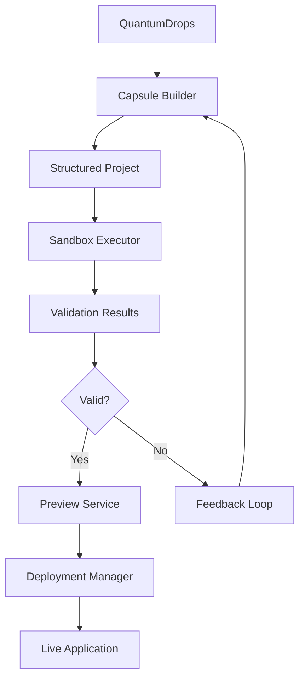

# QuantumCapsule Architecture

## Executive Summary

QuantumCapsule is an enterprise-grade code packaging and execution ecosystem that transforms generated code into fully structured, validated, and deployable applications. It bridges the gap between AI-generated code snippets and production-ready software packages.

## System Components

### 1. Sandbox Executor
**Purpose**: Safe, isolated code execution environment  
**Port**: 8091  
**Technology**: Docker-in-Docker, Go, Gin Framework

#### Features:
- Multi-language support (Python, JavaScript, TypeScript, Go, Java, Ruby, PHP)
- Resource limits (CPU, memory, disk)
- Timeout management
- Real-time output streaming via WebSocket
- Dependency installation
- Security isolation

#### API Endpoints:
- `POST /api/v1/execute` - Execute single file code
- `POST /api/v1/execute-project` - Execute multi-file projects
- `GET /api/v1/executions/:id` - Get execution status
- `GET /api/v1/executions/:id/stream` - WebSocket streaming
- `POST /api/v1/validate` - Validate code syntax
- `GET /api/v1/runtimes` - List supported languages

### 2. Capsule Builder
**Purpose**: Transform flat code into structured projects  
**Port**: 8092  
**Technology**: Go, Template Engine

#### Features:
- Language-specific project templates
- Framework detection and setup
- Dependency management
- Documentation generation
- Build configuration
- Test scaffolding

#### API Endpoints:
- `POST /api/v1/build` - Build structured capsule
- `GET /api/v1/capsules/:id` - Get capsule structure
- `GET /api/v1/capsules/:id/download` - Download as tar.gz
- `GET /api/v1/capsules/:id/files/*path` - Get specific file
- `POST /api/v1/preview` - Preview structure without building
- `GET /api/v1/templates` - List available templates

### 3. Preview Service (Planned)
**Purpose**: Web-based code preview and testing  
**Port**: 8093  
**Technology**: Next.js, Monaco Editor

#### Features:
- Syntax-highlighted code viewer
- Live execution results
- API testing interface
- Shareable preview URLs
- TTL-based cleanup

### 4. Deployment Manager (Planned)
**Purpose**: Deploy capsules to various environments  
**Port**: 8094  
**Technology**: Kubernetes Operator, Helm

#### Features:
- Kubernetes deployment
- Ingress management
- TTL-based resources
- Multi-environment support
- Rollback capability

## Data Flow



## Project Structure Templates

### Python FastAPI
```
project/
├── app/
│   ├── __init__.py
│   ├── main.py
│   ├── models.py
│   └── routes.py
├── tests/
│   └── test_main.py
├── requirements.txt
├── Dockerfile
├── .env.example
└── README.md
```

### Node.js Express
```
project/
├── src/
│   ├── index.js
│   ├── routes/
│   └── middleware/
├── tests/
│   └── main.test.js
├── package.json
├── Dockerfile
├── .env.example
└── README.md
```

### Go Gin
```
project/
├── main.go
├── handlers/
│   └── handlers.go
├── models/
│   └── models.go
├── middleware/
│   └── middleware.go
├── main_test.go
├── go.mod
├── Dockerfile
├── Makefile
└── README.md
```

## Execution Flow

### 1. Code Generation Phase
```
Workflow → LLM → Code Generation → QuantumDrops Storage
```

### 2. Structuring Phase
```
QuantumDrops → Capsule Builder → Template Application → Structured Project
```

### 3. Validation Phase
```
Structured Project → Sandbox Executor → Test Execution → Validation Results
```

### 4. Preview Phase
```
Validated Project → Preview Service → Web Interface → Shareable URL
```

### 5. Deployment Phase
```
Approved Project → Deployment Manager → Kubernetes → Live Application
```

## Security Architecture

### Sandbox Isolation
- Docker-in-Docker for container isolation
- Network isolation (`--network none` for execution)
- Resource limits enforcement
- No privileged operations
- Read-only filesystem where applicable

### Code Validation
- Syntax checking before execution
- Dependency vulnerability scanning
- Static code analysis
- Security policy enforcement

### Runtime Security
- Capability dropping (`--cap-drop ALL`)
- No new privileges (`--security-opt no-new-privileges`)
- Time-based resource limits
- Output size limits

## Integration Points

### With Existing Services

#### QuantumDrops Integration
```go
// Fetch drops from QuantumDrops service
resp, err := http.Get("http://quantum-drops:8090/api/v1/workflows/{id}/drops")
drops := parseDrops(resp)
```

#### Workflow Integration
```go
// Update workflow with capsule ID
updateWorkflow(workflowID, capsuleID)
```

#### LLM Router Integration
```go
// Request improvements for failed validations
improvement := requestCodeFix(llmRouter, code, errors)
```

## Deployment Options

### 1. Web Applications
- **Preview**: Temporary Kubernetes namespace
- **URL**: `https://{capsule-id}.preview.quantumlayer.io`
- **TTL**: 24 hours default
- **Features**: Live reload, SSL, WebSocket support

### 2. API Services
- **Preview**: Service + Ingress
- **URL**: `https://{capsule-id}-api.preview.quantumlayer.io`
- **Documentation**: Auto-generated OpenAPI/Swagger
- **Testing**: Built-in API tester

### 3. CLI Applications
- **Execution**: CloudShell integration
- **Access**: SSH or web terminal
- **Package**: Docker container

### 4. Libraries
- **Registry**: Private package registry
- **Documentation**: Auto-generated docs
- **Testing**: Automated test suite

### 5. Mobile Applications
- **Framework**: React Native / Flutter
- **Preview**: Expo Snack integration
- **Testing**: Device simulator

## Performance Metrics

### Sandbox Executor
- Execution time: < 30 seconds
- Concurrent executions: 100
- Memory per execution: 256MB - 2GB
- CPU per execution: 0.5 - 2 cores

### Capsule Builder
- Build time: < 5 seconds
- Concurrent builds: 50
- Template rendering: < 100ms

### Preview Service
- Preview generation: < 10 seconds
- Live update latency: < 500ms
- Concurrent previews: 100

## Monitoring & Observability

### Metrics
- Execution success rate
- Build success rate
- Average execution time
- Resource utilization
- Error rates by language

### Logging
- Structured logging (JSON)
- Correlation IDs
- Error tracking
- Performance profiling

### Tracing
- OpenTelemetry integration
- Distributed tracing
- Request flow visualization

## API Usage Examples

### Execute Code
```bash
curl -X POST http://sandbox-executor:8091/api/v1/execute \
  -H "Content-Type: application/json" \
  -d '{
    "language": "python",
    "code": "print(\"Hello, QuantumCapsule!\")",
    "timeout": 30
  }'
```

### Build Capsule
```bash
curl -X POST http://capsule-builder:8092/api/v1/build \
  -H "Content-Type: application/json" \
  -d '{
    "workflow_id": "wf-123",
    "language": "python",
    "framework": "fastapi",
    "type": "api",
    "name": "my-api",
    "code": "...",
    "dependencies": ["fastapi", "uvicorn"]
  }'
```

### Stream Execution
```javascript
const ws = new WebSocket('ws://sandbox-executor:8091/api/v1/executions/exec-123/stream');

ws.onmessage = (event) => {
    const data = JSON.parse(event.data);
    console.log(data.type, data.data);
};
```

## Future Enhancements

### Phase 1 (Current)
- ✅ Sandbox Executor
- ✅ Capsule Builder
- ⏳ Basic validation

### Phase 2 (Next)
- Preview Service
- TTL URL management
- WebSocket streaming
- Basic deployment

### Phase 3 (Future)
- Advanced security scanning
- Performance profiling
- A/B testing
- Multi-region deployment
- GPU support
- Kubernetes operator
- GitOps integration

## Conclusion

The QuantumCapsule ecosystem transforms the QuantumLayer platform from a simple code generator into a complete application development and deployment platform. It provides the missing link between AI-generated code and production-ready applications, with enterprise-grade security, validation, and deployment capabilities.