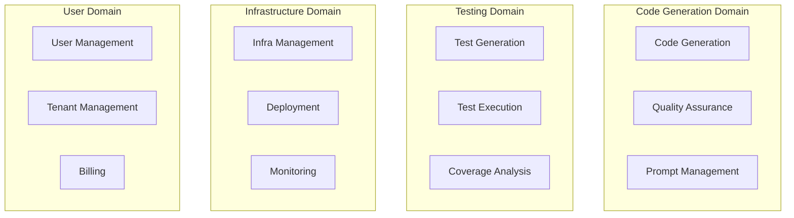
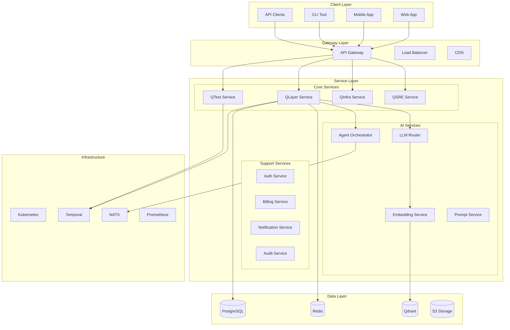
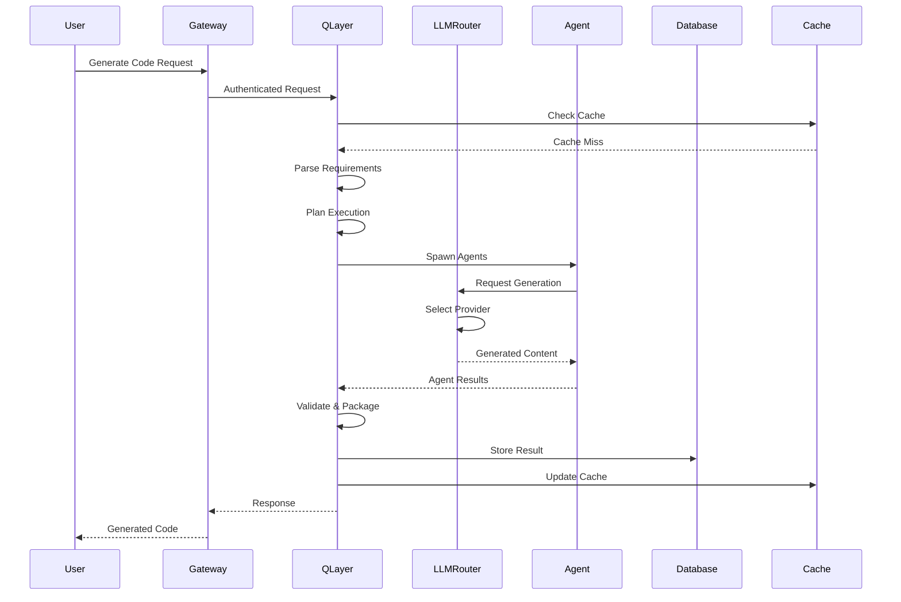
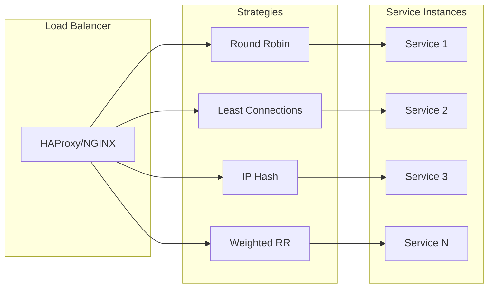
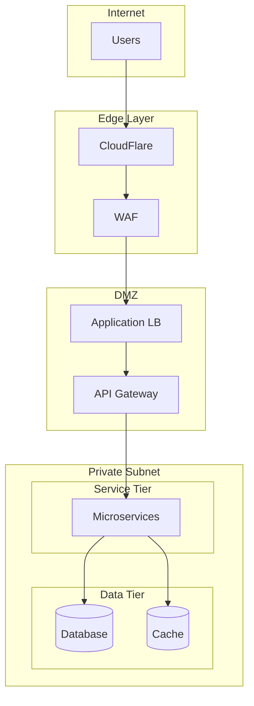

# 🏗️ QuantumLayer V2 - System Architecture Documentation

## Table of Contents
1. [Executive Overview](#executive-overview)
2. [Architecture Principles](#architecture-principles)
3. [System Components](#system-components)
4. [Service Architecture](#service-architecture)
5. [Data Flow](#data-flow)
6. [Integration Points](#integration-points)
7. [Scalability Design](#scalability-design)
8. [Architecture Decisions](#architecture-decisions)

---

## Executive Overview

QuantumLayer V2 is a distributed, microservices-based platform designed to transform natural language requirements into production-ready applications. The architecture supports multi-tenancy, horizontal scaling, and deployment across multiple cloud providers.

### Architecture Style
- **Primary**: Microservices with Event-Driven Architecture
- **Secondary**: Serverless for specific functions
- **Patterns**: CQRS, Saga, Circuit Breaker, Bulkhead

### Technology Stack Overview
```yaml
Core:
  Languages: [Go, TypeScript, Python]
  Runtime: [Node.js 20+, Go 1.22+, Python 3.11+]
  
Backend:
  API: [GraphQL (primary), REST, gRPC (internal)]
  Database: [PostgreSQL 16, Redis 7]
  Vector DB: [Qdrant]
  Queue: [NATS JetStream]
  Workflow: [Temporal v2]
  
Frontend:
  Framework: [Next.js 14]
  State: [Zustand, React Query]
  UI: [Tailwind CSS, Radix UI]
  
Infrastructure:
  Container: [Docker]
  Orchestration: [Kubernetes]
  Service Mesh: [Istio]
  Monitoring: [Prometheus, Grafana]
```

---

## Architecture Principles

### 1. Domain-Driven Design (DDD)


### 2. Separation of Concerns
- **Presentation Layer**: UI/UX, API Gateway
- **Business Logic Layer**: Core services, domain logic
- **Data Access Layer**: Repositories, DAOs
- **Infrastructure Layer**: Cloud resources, external services

### 3. Eventual Consistency
- Async communication between services
- Event sourcing for audit trail
- CQRS for read/write optimization

---

## System Components

### High-Level Architecture


### Component Descriptions

| Component | Purpose | Technology | Scaling Strategy |
|-----------|---------|------------|------------------|
| **API Gateway** | Request routing, auth, rate limiting | Kong/Envoy | Horizontal |
| **QLayer Service** | Code generation orchestration | Go | Horizontal |
| **LLM Router** | Multi-provider LLM management | Go | Horizontal |
| **Agent Orchestrator** | Agent lifecycle management | Go + Temporal | Horizontal |
| **PostgreSQL** | Primary data store | PostgreSQL 16 | Master-Slave |
| **Redis** | Cache & session store | Redis 7 | Cluster |
| **Qdrant** | Vector similarity search | Qdrant | Cluster |
| **Temporal** | Workflow orchestration | Temporal v2 | Cluster |
| **NATS** | Event streaming | NATS JetStream | Cluster |

---

## Service Architecture

### 1. QLayer Service (Code Generation)
```go
// services/qlayer/architecture.go
package qlayer

type QLayerService struct {
    // Core Components
    Parser         *NLPParser
    Planner        *ExecutionPlanner
    AgentManager   *AgentManager
    Generator      *CodeGenerator
    Validator      *QualityValidator
    Packager       *QuantumCapsulePackager
    
    // Dependencies
    LLMRouter      *llm.Router
    Database       *db.Connection
    Cache          *cache.Redis
    EventBus       *events.NATS
    Workflow       *temporal.Client
    
    // Observability
    Metrics        *metrics.Collector
    Logger         *logging.Logger
    Tracer         *tracing.Tracer
}

// Service Interface
type IQLayerService interface {
    // Core Operations
    GenerateCode(ctx context.Context, req GenerationRequest) (*GenerationResponse, error)
    ValidateCode(ctx context.Context, code string) (*ValidationResult, error)
    PackageCode(ctx context.Context, code string) (*QuantumCapsule, error)
    
    // Agent Operations
    SpawnAgent(ctx context.Context, type AgentType) (*Agent, error)
    OrchestrateAgents(ctx context.Context, agents []*Agent) (*Result, error)
    
    // Workflow Operations
    StartWorkflow(ctx context.Context, workflow WorkflowType) (*WorkflowID, error)
    GetWorkflowStatus(ctx context.Context, id WorkflowID) (*Status, error)
}
```

### 2. LLM Router Service
```go
// services/llm/router.go
package llm

type LLMRouter struct {
    Providers map[string]Provider
    
    // Routing Logic
    CostOptimizer    *CostOptimizer
    LatencyOptimizer *LatencyOptimizer
    QualityScorer    *QualityScorer
    
    // Resilience
    CircuitBreaker   *CircuitBreaker
    RetryManager     *RetryManager
    FallbackChain    []Provider
    
    // Monitoring
    UsageTracker     *UsageTracker
    CostTracker      *CostTracker
}

type RoutingStrategy interface {
    SelectProvider(context Context, request Request) (Provider, error)
}

// Strategies
type CostBasedRouting struct{}
type LatencyBasedRouting struct{}
type QualityBasedRouting struct{}
type HybridRouting struct{
    Weights map[string]float64
}
```

### 3. Agent Architecture
```typescript
// services/agents/architecture.ts
interface AgentArchitecture {
  // Agent Types
  agents: {
    ProjectManager: {
      responsibilities: ['requirements_analysis', 'task_breakdown'],
      llm: 'high_reasoning',
      context_window: 'large'
    },
    
    Architect: {
      responsibilities: ['system_design', 'technology_selection'],
      llm: 'technical',
      tools: ['diagram_generator', 'pattern_matcher']
    },
    
    Developer: {
      responsibilities: ['code_generation', 'implementation'],
      llm: 'code_specialized',
      languages: ['all'],
      frameworks: ['detected']
    },
    
    QAEngineer: {
      responsibilities: ['test_generation', 'quality_check'],
      llm: 'testing_focused',
      coverage_target: 0.8
    },
    
    DevOpsEngineer: {
      responsibilities: ['infrastructure', 'deployment'],
      llm: 'infrastructure',
      platforms: ['kubernetes', 'docker', 'terraform']
    }
  },
  
  // Communication Protocol
  communication: {
    protocol: 'event_driven',
    format: 'protobuf',
    bus: 'NATS',
    patterns: ['pub_sub', 'request_reply', 'queue_group']
  },
  
  // Orchestration
  orchestration: {
    engine: 'Temporal',
    workflows: ['sequential', 'parallel', 'conditional'],
    compensation: 'saga_pattern'
  }
}
```

---

## Data Flow

### 1. Code Generation Flow


### 2. Event Flow
```yaml
Event Bus Architecture:
  Publishers:
    - QLayer Service
    - QTest Service
    - Auth Service
    - Billing Service
  
  Topics:
    code.generated:
      subscribers: [Analytics, Billing, Notification]
      retention: 7d
      
    test.completed:
      subscribers: [QLayer, Notification]
      retention: 3d
      
    user.action:
      subscribers: [Analytics, Audit]
      retention: 30d
      
    system.alert:
      subscribers: [SRE, Notification]
      retention: 90d
  
  Patterns:
    - Pub/Sub for notifications
    - Queue Groups for load distribution
    - Request/Reply for synchronous operations
```

---

## Integration Points

### 1. External Services
```typescript
interface ExternalIntegrations {
  // LLM Providers
  llm: {
    openai: {
      endpoint: 'https://api.openai.com/v1',
      auth: 'bearer_token',
      models: ['gpt-4', 'gpt-4-turbo']
    },
    anthropic: {
      endpoint: 'https://api.anthropic.com/v1',
      auth: 'api_key',
      models: ['claude-3-opus', 'claude-3-sonnet']
    },
    bedrock: {
      endpoint: 'https://bedrock.amazonaws.com',
      auth: 'aws_v4',
      models: ['claude', 'llama', 'mistral']
    },
    groq: {
      endpoint: 'https://api.groq.com/v1',
      auth: 'api_key',
      models: ['llama-70b', 'mixtral']
    }
  },
  
  // Cloud Providers
  cloud: {
    aws: {
      services: ['S3', 'EKS', 'RDS', 'CloudFront'],
      auth: 'iam_role'
    },
    azure: {
      services: ['Storage', 'AKS', 'Database'],
      auth: 'service_principal'
    },
    gcp: {
      services: ['GCS', 'GKE', 'CloudSQL'],
      auth: 'service_account'
    }
  },
  
  // Third-Party Services
  services: {
    stripe: {
      purpose: 'payments',
      api_version: '2023-10-16'
    },
    clerk: {
      purpose: 'authentication',
      api_version: 'v1'
    },
    sendgrid: {
      purpose: 'email',
      api_version: 'v3'
    },
    twilio: {
      purpose: 'sms',
      api_version: '2010-04-01'
    }
  }
}
```

### 2. Internal APIs
```protobuf
// proto/internal.proto
syntax = "proto3";

service InternalAPI {
  // Inter-service communication
  rpc GenerateCode(GenerateRequest) returns (GenerateResponse);
  rpc RunTests(TestRequest) returns (TestResponse);
  rpc DeployApp(DeployRequest) returns (DeployResponse);
  rpc GetMetrics(MetricsRequest) returns (MetricsResponse);
}

message GenerateRequest {
  string tenant_id = 1;
  string user_id = 2;
  string prompt = 3;
  map<string, string> parameters = 4;
  GenerationOptions options = 5;
}

message GenerationOptions {
  string language = 1;
  string framework = 2;
  int32 max_tokens = 3;
  float temperature = 4;
  repeated string providers = 5;
}
```

---

## Scalability Design

### 1. Horizontal Scaling Strategy
```yaml
Scaling Policies:
  QLayer Service:
    min_replicas: 3
    max_replicas: 100
    metrics:
      - cpu: 70%
      - memory: 80%
      - request_rate: 100/sec
      - queue_depth: 1000
    
  LLM Router:
    min_replicas: 5
    max_replicas: 50
    metrics:
      - request_latency: 500ms
      - error_rate: 1%
    
  Database:
    strategy: read_replicas
    master: 1
    replicas: 5
    auto_failover: true
    
  Cache:
    strategy: redis_cluster
    nodes: 6
    replication: 2
```

### 2. Load Distribution


### 3. Caching Strategy
```typescript
interface CachingArchitecture {
  layers: {
    cdn: {
      provider: 'CloudFlare',
      ttl: '1h',
      content: ['static_assets', 'api_responses']
    },
    
    application: {
      type: 'Redis',
      ttl: '15m',
      content: ['session_data', 'frequent_queries']
    },
    
    database: {
      type: 'Query_Cache',
      ttl: '5m',
      content: ['prepared_statements', 'result_sets']
    },
    
    local: {
      type: 'In_Memory',
      ttl: '1m',
      content: ['hot_data', 'configurations']
    }
  },
  
  invalidation: {
    strategies: ['ttl_based', 'event_based', 'manual'],
    patterns: ['cache_aside', 'write_through', 'write_behind']
  }
}
```

---

## Architecture Decisions

### ADR-001: Microservices over Monolith
**Status**: Accepted  
**Context**: Need to scale different components independently  
**Decision**: Use microservices architecture  
**Consequences**: 
- ✅ Independent scaling
- ✅ Technology diversity
- ❌ Increased complexity
- ❌ Network latency

### ADR-002: Go for Core Services
**Status**: Accepted  
**Context**: Need high performance and concurrency  
**Decision**: Use Go for backend services  
**Consequences**:
- ✅ Excellent performance
- ✅ Native concurrency
- ✅ Small memory footprint
- ❌ Smaller talent pool

### ADR-003: PostgreSQL as Primary Database
**Status**: Accepted  
**Context**: Need ACID compliance and complex queries  
**Decision**: Use PostgreSQL with multi-tenancy  
**Consequences**:
- ✅ ACID compliance
- ✅ Rich feature set
- ✅ Excellent tooling
- ❌ Vertical scaling limitations

### ADR-004: Temporal for Workflows
**Status**: Accepted  
**Context**: Need reliable workflow orchestration  
**Decision**: Use Temporal v2  
**Consequences**:
- ✅ Durable execution
- ✅ Built-in retries
- ✅ Saga pattern support
- ❌ Additional infrastructure

### ADR-005: Multi-Cloud Strategy
**Status**: Accepted  
**Context**: Avoid vendor lock-in  
**Decision**: Support AWS, Azure, GCP, and on-premise  
**Consequences**:
- ✅ Flexibility
- ✅ Negotiation leverage
- ❌ Increased complexity
- ❌ Higher operational overhead

---

## Deployment Topology

### Production Environment
```yaml
Production:
  Regions:
    Primary:
      location: us-east-1
      services: all
      database: master
      
    Secondary:
      location: eu-west-1
      services: all
      database: replica
      
    DR:
      location: us-west-2
      services: standby
      database: replica
  
  Load Distribution:
    - GeoDNS for region routing
    - Cross-region replication
    - Active-active for stateless services
    - Active-passive for stateful services
```

### Network Architecture


---

## Security Architecture

### Defense in Depth
```yaml
Security Layers:
  1. Edge:
     - DDoS protection
     - Rate limiting
     - Geographic filtering
     
  2. Network:
     - VPC isolation
     - Security groups
     - NACLs
     
  3. Application:
     - Authentication (JWT)
     - Authorization (RBAC)
     - Input validation
     
  4. Data:
     - Encryption at rest
     - Encryption in transit
     - Key management (KMS)
     
  5. Monitoring:
     - SIEM integration
     - Anomaly detection
     - Audit logging
```

---

## Disaster Recovery

### RTO/RPO Targets
- **RTO** (Recovery Time Objective): 1 hour
- **RPO** (Recovery Point Objective): 5 minutes

### Backup Strategy
```yaml
Backups:
  Database:
    frequency: continuous (streaming replication)
    retention: 30 days
    locations: [primary_region, dr_region, s3]
    
  Application State:
    frequency: every 5 minutes
    retention: 7 days
    
  Configuration:
    frequency: on change
    retention: infinite
    version_controlled: true
```

---

## Performance Considerations

### Optimization Strategies
1. **Database**: Connection pooling, query optimization, indexing
2. **Caching**: Multi-layer caching, cache warming
3. **Network**: HTTP/2, compression, CDN
4. **Application**: Async processing, batch operations
5. **Infrastructure**: Auto-scaling, resource optimization

### Performance Targets
```yaml
Targets:
  API_Latency:
    p50: 50ms
    p95: 200ms
    p99: 500ms
    
  Throughput:
    sustained: 10,000 req/sec
    peak: 50,000 req/sec
    
  Availability:
    monthly: 99.99%
    yearly: 99.95%
```

---

*Architecture Version: 2.0*  
*Last Updated: Current Session*  
*Next Review: Quarterly*