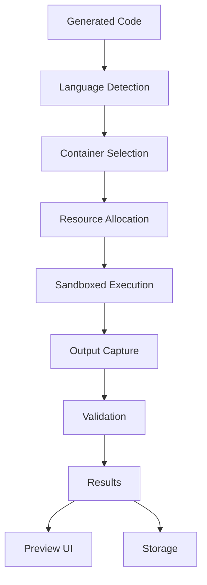
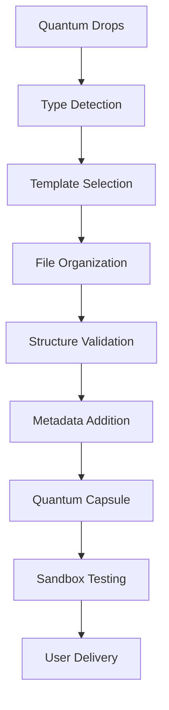

# QuantumLayer: Vision vs Reality Gap Analysis

## Executive Summary

The platform currently delivers **25% of its vision**. This document outlines what's missing and how to achieve the full vision.

## 1. Current Reality vs Vision

### Vision: Enterprise-Grade AI Code Factory
### Reality: Template-Based Code Generator with LLM Fallbacks

## 2. Critical Missing Components

### A. Sandbox Execution Environment
**Vision**: Execute and validate generated code in secure sandboxes
**Reality**: No execution environment exists
**Solution Required**:
```yaml
Sandbox Service:
  - Docker-in-Docker or Kata Containers
  - Language-specific runtime containers
  - Resource limits and timeouts
  - Security isolation
  - Output capture and validation
```

### B. Enterprise Folder Structure System
**Vision**: Intelligent organization of generated artifacts
**Reality**: Flat text blobs in PostgreSQL
**Solution Required**:
```
QuantumDrop Structure:
/project-root/
├── src/
│   ├── main/
│   │   ├── java/com/example/...
│   │   └── resources/
│   └── test/
│       ├── java/com/example/...
│       └── resources/
├── docs/
│   ├── api/
│   ├── design/
│   └── README.md
├── config/
│   ├── development/
│   ├── staging/
│   └── production/
├── scripts/
│   ├── build/
│   └── deploy/
├── .quantum/
│   ├── metadata.json
│   ├── validation-report.json
│   └── dependencies.lock
└── Dockerfile
```

### C. Meta-Prompt Intelligence System
**Vision**: AI-powered prompt optimization
**Reality**: Template variable substitution
**Solution Required**:
```python
class MetaPromptOptimizer:
    def optimize(self, prompt):
        # 1. Analyze prompt intent
        intent = self.analyze_intent(prompt)
        
        # 2. Enhance with context
        enhanced = self.add_context(prompt, intent)
        
        # 3. Apply best practices
        optimized = self.apply_patterns(enhanced)
        
        # 4. Validate with LLM
        validated = self.llm_validate(optimized)
        
        # 5. A/B test results
        return self.ab_test(validated)
```

### D. Preview & Validation System
**Vision**: Live preview of generated code with validation
**Reality**: No preview capability
**Solution Required**:
```
Preview Pipeline:
1. Code Generation → 
2. Syntax Validation →
3. Dependency Resolution →
4. Build Verification →
5. Test Execution →
6. Security Scanning →
7. Performance Analysis →
8. Live Preview UI
```

## 3. Implementation Roadmap

### Phase 1: Foundation (Week 1-2)
1. **Structured Storage System**
   - Implement hierarchical storage in QuantumDrops
   - Add folder structure templates per language/framework
   - Create artifact organization service

2. **Basic Sandbox Environment**
   - Deploy Docker-in-Docker service
   - Create language runtime containers
   - Implement execution API

### Phase 2: Intelligence (Week 3-4)
3. **Real Meta-Prompt System**
   - Implement prompt analysis engine
   - Add context enhancement
   - Create optimization patterns library
   - Deploy A/B testing framework

4. **Validation Pipeline**
   - Integrate actual code parsers
   - Add real security scanners (Snyk/SonarQube)
   - Implement test runners
   - Create build verification

### Phase 3: Preview & Polish (Week 5-6)
5. **Preview System**
   - Web-based code viewer
   - Live execution results
   - Test output display
   - Validation reports UI

6. **Enterprise Features**
   - Multi-tenant isolation
   - Role-based access control
   - Audit logging
   - Compliance reporting

## 4. Technical Implementation Details

### Sandbox Service Architecture
```go
type SandboxService struct {
    runtimeContainers map[string]RuntimeContainer
    executor         ContainerExecutor
    validator        CodeValidator
    limiter          ResourceLimiter
}

type ExecutionResult struct {
    Output      string
    Error       string
    ExitCode    int
    Metrics     ExecutionMetrics
    Validation  ValidationReport
}

func (s *SandboxService) Execute(code Code) (*ExecutionResult, error) {
    // 1. Select runtime container
    container := s.selectRuntime(code.Language)
    
    // 2. Prepare execution environment
    env := s.prepareEnvironment(code)
    
    // 3. Execute with limits
    result := s.executor.RunWithLimits(container, code, env)
    
    // 4. Validate results
    validation := s.validator.Validate(result)
    
    return &ExecutionResult{
        Output:     result.Output,
        Error:      result.Error,
        ExitCode:   result.ExitCode,
        Metrics:    s.collectMetrics(result),
        Validation: validation,
    }, nil
}
```

### Enterprise Folder Structure Service
```go
type FolderStructureService struct {
    templates map[string]ProjectTemplate
    organizer FileOrganizer
}

type ProjectTemplate struct {
    Language    string
    Framework   string
    Type        string // api, library, cli, web
    Structure   FolderStructure
}

type FolderStructure struct {
    Directories []Directory
    Files       []FileTemplate
    Metadata    ProjectMetadata
}

func (f *FolderStructureService) OrganizeArtifacts(drops []QuantumDrop) (*QuantumCapsule, error) {
    // 1. Detect project type
    projectType := f.detectProjectType(drops)
    
    // 2. Get template
    template := f.templates[projectType]
    
    // 3. Organize drops into structure
    organized := f.organizer.Organize(drops, template)
    
    // 4. Validate structure
    if err := f.validateStructure(organized); err != nil {
        return nil, err
    }
    
    // 5. Create capsule
    return f.createCapsule(organized)
}
```

### Preview System Architecture
```go
type PreviewService struct {
    sandbox   SandboxService
    storage   StorageService
    websocket WebSocketServer
}

func (p *PreviewService) GeneratePreview(capsuleID string) (*Preview, error) {
    // 1. Load capsule
    capsule := p.storage.LoadCapsule(capsuleID)
    
    // 2. Extract code
    code := capsule.ExtractCode()
    
    // 3. Run in sandbox
    result := p.sandbox.Execute(code)
    
    // 4. Generate preview
    preview := &Preview{
        Code:       code,
        Output:     result.Output,
        Tests:      p.runTests(capsule),
        Validation: result.Validation,
        Metrics:    result.Metrics,
    }
    
    // 5. Stream to UI
    p.websocket.Stream(preview)
    
    return preview, nil
}
```

## 5. Feasibility Assessment

### Can We Build Preview/Sandbox Features?

**YES, but it requires:**

1. **Container Orchestration Expertise**
   - Kubernetes Jobs for sandboxed execution
   - Resource quotas and security policies
   - Network isolation

2. **Frontend Development**
   - React/Next.js preview UI
   - WebSocket for live updates
   - Monaco editor integration

3. **Security Hardening**
   - Sandboxed execution environments
   - Input sanitization
   - Resource limits

4. **Infrastructure Investment**
   - Additional compute for sandboxes
   - Storage for execution results
   - Enhanced monitoring

## 6. Recommended Next Steps

### Immediate Actions (This Week)
1. **Honest Assessment**
   - Update documentation to reflect reality
   - Set realistic timelines
   - Define MVP vs future features

2. **Fix Core Issues**
   - Replace template fallbacks with real AI
   - Implement actual validation
   - Add basic folder structure

### Short Term (2-4 Weeks)
3. **Build Sandbox MVP**
   - Simple Docker execution
   - Basic output capture
   - Language support (Python, Node.js)

4. **Create Preview UI**
   - Basic web interface
   - Code display with syntax highlighting
   - Execution results view

### Medium Term (1-2 Months)
5. **Enterprise Features**
   - Multi-language sandbox support
   - Advanced folder structures
   - Real security scanning
   - Performance profiling

6. **Production Hardening**
   - Comprehensive testing
   - Security audit
   - Performance optimization
   - Documentation

## 7. Cost-Benefit Analysis

### Investment Required
- **Development Time**: 6-8 weeks for core features
- **Infrastructure**: +$500-1000/month for sandbox compute
- **Tools**: Security scanning licenses, monitoring tools

### Expected Benefits
- **Actual Value Delivery**: Move from 25% to 80% vision completion
- **Market Differentiation**: Real sandbox/preview is rare in code generation
- **Enterprise Credibility**: Deliver on promised features
- **User Trust**: Validated, tested code vs blind generation

## 8. Conclusion

The QuantumLayer platform has a solid foundation but needs significant work to deliver its vision. The gap between marketing claims and reality must be closed through:

1. **Sandboxed execution environment**
2. **Enterprise folder organization**
3. **Real AI-powered optimization**
4. **Preview and validation system**
5. **Honest documentation**

With focused development over 6-8 weeks, the platform can evolve from a sophisticated prototype to a genuine enterprise-grade solution.

## 9. Architecture Diagrams

### Current Architecture
```
User → API → Workflow → LLM → Database → Tar.gz
```

### Target Architecture
```
User → API → Meta-Prompt Optimizer → Workflow → 
LLM → Structured Storage → Validation → 
Sandbox Execution → Preview UI → 
Verified QuantumCapsule → User
```

### Sandbox Execution Flow


### Folder Structure Organization
