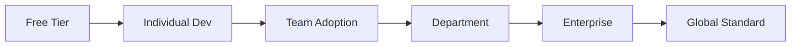

# 🚀 QuantumLayer V2: Billion-Dollar WOW Features

## Executive Summary
These features transform QuantumLayer from a code generation tool into a complete AI-powered software ecosystem that can capture and dominate the $500B software development market.

---

## 1. 💎 GAME-CHANGING FEATURES

### 1.1 Quantum Marketplace
**The App Store for AI-Generated Components**

```yaml
marketplace:
  categories:
    - Authentication Systems ($10-100)
    - Payment Integrations ($50-500)
    - AI Models ($100-1000)
    - Complete Applications ($500-5000)
    - Industry Solutions ($1000-10000)
  
  revenue_model:
    - 70% to creators
    - 30% platform fee
    - Premium listings
    - Sponsored components
    - Enterprise private stores
  
  projected_gmv:
    year_1: $10M
    year_2: $100M
    year_3: $1B
```

### 1.2 Voice-First Development
**"Hey Quantum, build me a CRM"**

- Natural conversation to code
- Multi-language support (50+ languages)
- Team voice collaboration
- Accessibility compliance
- Voice debugging assistant

### 1.3 Instant Mobile Apps
**Web to Native in One Click**

- Progressive Web App generation
- React Native optimization
- Flutter cross-platform
- App Store submission automation
- Built-in mobile analytics

### 1.4 Business Logic Compiler
**MBA to Code Translation**

```typescript
interface BusinessLogicCompiler {
  input: {
    businessModel: "SaaS" | "Marketplace" | "E-commerce" | "FinTech"
    monetization: "Subscription" | "Transaction" | "Freemium"
    regulations: ["GDPR", "HIPAA", "SOX"]
    scale: "Startup" | "SMB" | "Enterprise"
  }
  
  output: {
    architecture: CompleteSystemDesign
    code: ProductionReadyApplication
    infrastructure: ScalableDeployment
    compliance: RegulatoryFramework
    documentation: CompleteDocs
  }
}
```

---

## 2. 🌟 VIRAL GROWTH ENGINES

### 2.1 Powered By QuantumLayer
- Visible badge on all generated apps
- SEO benefits for badge users
- Click-through to platform
- Success story showcases

### 2.2 University Program
- Free tier for students
- Curriculum integration
- Hackathon sponsorships
- Job placement program
- Research partnerships

### 2.3 Open Source Tier
- 1000 free generations/month for OSS
- Public project showcases
- Community contributions
- GitHub integration
- NPM package generation

### 2.4 Referral Ecosystem
```yaml
referral_program:
  direct_referral: 30% recurring for 12 months
  influencer_tier: 40% recurring + bonuses
  enterprise_referral: $10,000 per contract
  developer_ambassador: Free unlimited access
```

---

## 3. 🤖 AI REVOLUTION FEATURES

### 3.1 Quantum Twin
**Your AI Development Team**

- Personalized AI that learns your style
- Remembers all your projects
- Proactive suggestions
- Code review partner
- Architecture advisor

### 3.2 Time Machine
**Version Control on Steroids**

- Visual timeline of changes
- "What if" branching
- Parallel universe development
- Instant rollback to any state
- Future prediction modeling

### 3.3 Global Learning Network
**Collective Intelligence**

- Learn from millions of deployments
- Anonymous pattern sharing
- Industry best practices
- Security vulnerability database
- Performance optimization patterns

### 3.4 Self-Healing Systems
**Infrastructure that Fixes Itself**

```python
class SelfHealingInfra:
    def detect_issue(self):
        # AI monitors all metrics
        return anomaly_detection()
    
    def diagnose(self, issue):
        # Understand root cause
        return ai_diagnosis(issue)
    
    def fix(self, diagnosis):
        # Automatically repair
        return apply_fix(diagnosis)
    
    def prevent(self, pattern):
        # Prevent future occurrences
        return update_defenses(pattern)
```

---

## 4. 💰 REVENUE MULTIPLIERS

### 4.1 Quantum Cloud
**Managed Hosting Platform**

- One-click deployment
- Auto-scaling included
- $50-5000/month per app
- 70% gross margins
- Integrated CDN

### 4.2 Quantum Academy
**Education Platform**

- Video courses ($99-999)
- Certification programs ($500-2000)
- Corporate training ($10K-100K)
- Live workshops ($299-999)
- Annual conference ($1000/ticket)

### 4.3 Quantum Consulting
**AI-Augmented Services**

- Implementation services ($100K-1M)
- Custom model training ($50K-500K)
- Enterprise support ($10K-50K/month)
- Migration services ($100K-5M)
- Digital transformation ($500K-10M)

### 4.4 Quantum Capital
**FinTech Integration**

- Revenue-based financing for apps
- Instant credit for resources
- Payment processing (2.9% + $0.30)
- Subscription management
- Global payments

---

## 5. 🎯 MARKET DOMINATION STRATEGY

### 5.1 Land and Expand


### 5.2 Platform Lock-in (Positive)
- Seamless experience
- Data portability guaranteed
- Open standards
- API-first approach
- No vendor lock-in fear

### 5.3 Network Effects
- More users = better AI
- More components = more value
- More integrations = stickier platform
- More data = smarter generation
- More success = more trust

---

## 6. 🏆 COMPETITIVE MOATS

### 6.1 Data Moat
- Largest code generation dataset
- Proprietary training data
- Real-world deployment feedback
- Cross-industry patterns
- Continuous learning loop

### 6.2 Technology Moat
- Patent-pending algorithms
- Custom LLM optimizations
- Proprietary LoRA adaptations
- Unique agent orchestration
- Revolutionary UI/UX

### 6.3 Ecosystem Moat
- Developer community
- Enterprise relationships
- University partnerships
- Integration network
- Marketplace liquidity

### 6.4 Brand Moat
- "QuantumLayer Inside"
- Thought leadership
- Industry standards influence
- Developer mindshare
- Enterprise trust

---

## 7. 🎪 WOW DEMONSTRATIONS

### 7.1 The 60-Second Startup
**Live Demo Script**
1. "Build me a Uber for dog walkers"
2. AI generates complete platform
3. Deploy to production
4. First user signs up
5. First transaction processed
**Time: 60 seconds**

### 7.2 The Voice Challenge
**Audience Participation**
1. Random audience member speaks idea
2. AI builds it live
3. QR code for instant access
4. They test their app
**Time: 2 minutes**

### 7.3 The Integration Magic
**Enterprise Demo**
1. Connect to Salesforce
2. Generate custom CRM
3. Migrate data
4. Show ROI calculator
**Time: 5 minutes**

---

## 8. 📊 BILLION DOLLAR METRICS

### 8.1 Unit Economics
```yaml
CAC: $50  # Customer Acquisition Cost
LTV: $5,000  # Lifetime Value
Payback: 2 months
Gross Margin: 85%
Net Margin: 40%
```

### 8.2 Growth Trajectory
| Year | Users | Revenue | Valuation |
|------|-------|---------|-----------|
| 1 | 10K | $5M | $50M |
| 2 | 100K | $50M | $500M |
| 3 | 1M | $200M | $2B |
| 4 | 5M | $500M | $5B |
| 5 | 10M | $1B | $10B |

### 8.3 Market Capture
- TAM: $500B (Global Software Development)
- SAM: $50B (AI-Assisted Development)
- SOM: $5B (1% in 5 years)

---

## 9. 🚁 MOONSHOT FEATURES

### 9.1 Quantum OS
**Operating System that Writes Itself**
- Apps generate on-demand
- No installation needed
- Instant functionality
- AI-first computing

### 9.2 Neural Coding
**Think and Code**
- Brain-computer interface
- Thought to application
- EEG/Neural integration
- Accessibility revolution

### 9.3 Quantum Metaverse
**Virtual Development Worlds**
- VR/AR coding environments
- 3D architecture visualization
- Collaborative virtual spaces
- Spatial computing

### 9.4 AGI Integration
**When AGI Arrives**
- First platform ready
- Seamless integration
- Human-AGI collaboration
- Ethical AI framework

---

## 10. 🎬 GO-TO-MARKET WOW

### 10.1 Launch Strategy
**"The 1000 Apps in 24 Hours Challenge"**
- Live stream event
- Celebrity entrepreneurs
- Charity component
- Guinness World Record
- Global media coverage

### 10.2 Influencer Army
- Top 100 developers
- YouTube creators
- Tech podcasters
- Twitter developers
- LinkedIn thought leaders

### 10.3 Enterprise Penetration
- Fortune 500 pilots
- CTO advisory board
- Industry conferences
- Gartner Magic Quadrant
- Forrester Wave Leader

---

## 🎯 SUCCESS FORMULA

```
Billion Dollar Valuation = 
  (Revolutionary Product) × 
  (Viral Growth) × 
  (Network Effects) × 
  (Enterprise Sales) × 
  (Ecosystem Moat) × 
  (Perfect Timing)
```

**QuantumLayer has all six components.**

---

## NEXT STEPS

1. **Immediate** (Week 1)
   - Finalize core architecture
   - Begin marketplace design
   - Start voice interface prototype

2. **Short-term** (Month 1)
   - Launch beta program
   - Onboard first 100 developers
   - Generate first $10K revenue

3. **Medium-term** (Quarter 1)
   - Scale to 1,000 users
   - Launch marketplace
   - Secure Series A funding

4. **Long-term** (Year 1)
   - 10,000 active users
   - $1M ARR
   - Series B at $100M valuation

---

*"We're not building a product. We're building the future of software development."*

**- QuantumLayer: Where Ideas Become Reality™**