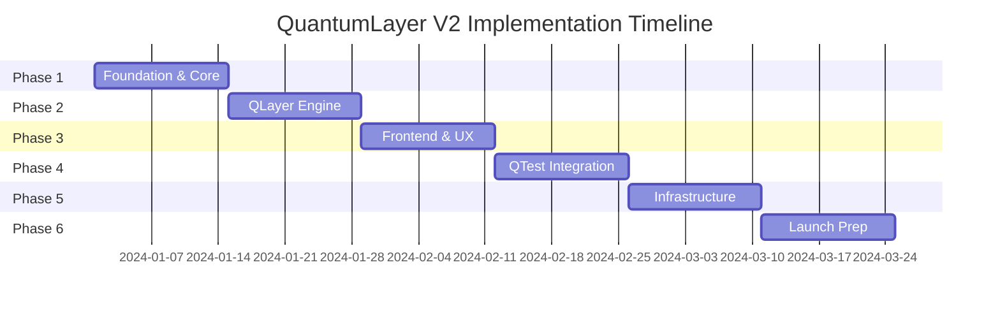

# 🎯 QuantumLayer V2 - Master Implementation Plan & Tracker

## Executive Summary
A comprehensive 12-week plan to build and launch QuantumLayer V2, with detailed tracking, metrics, and milestones for achieving $1M ARR in Year 1.

---

## 📅 Timeline Overview



---

## 🏗️ PHASE 1: FOUNDATION (Weeks 1-2)
**Goal**: Establish core infrastructure and multi-LLM support

### Week 1: Core Setup
| Day | Task | Owner | Status | Notes |
|-----|------|-------|--------|-------|
| **Mon** | Create GitHub repo & monorepo structure | DevOps | ⬜ Not Started | Use Turborepo |
| | Setup development environment | All | ⬜ Not Started | Docker Compose |
| | Initialize Go backend structure | Backend | ⬜ Not Started | Go 1.22+ |
| | Setup PostgreSQL & Redis | DevOps | ⬜ Not Started | Docker containers |
| **Tue** | Implement LLM abstraction layer | Backend | ⬜ Not Started | Provider interface |
| | OpenAI adapter | Backend | ⬜ Not Started | GPT-4 support |
| | Anthropic adapter | Backend | ⬜ Not Started | Claude 3 support |
| **Wed** | AWS Bedrock integration | Backend | ⬜ Not Started | Multi-model |
| | Groq integration | Backend | ⬜ Not Started | Fast inference |
| | Local model support | Backend | ⬜ Not Started | Ollama/vLLM |
| **Thu** | Implement intelligent router | Backend | ⬜ Not Started | Cost/speed/quality |
| | Circuit breaker pattern | Backend | ⬜ Not Started | Resilience |
| | Retry mechanism | Backend | ⬜ Not Started | Smart retries |
| **Fri** | API Gateway setup | Backend | ⬜ Not Started | GraphQL primary |
| | Authentication with Clerk | Backend | ⬜ Not Started | User management |
| | Basic monitoring | DevOps | ⬜ Not Started | Prometheus |

### Week 1 Success Metrics
- [ ] ✅ Repository created and structured
- [ ] 📊 All 5 LLM providers integrated
- [ ] 🔄 Intelligent routing working
- [ ] 🔐 Authentication implemented
- [ ] 📈 Basic monitoring active

### Week 2: Advanced Foundation
| Day | Task | Owner | Status | Notes |
|-----|------|-------|--------|-------|
| **Mon** | Temporal workflow setup | Backend | ⬜ Not Started | v2 installation |
| | Basic workflow definitions | Backend | ⬜ Not Started | Simple, complex |
| **Tue** | Qdrant vector DB setup | Backend | ⬜ Not Started | Docker deployment |
| | Embedding pipeline | Backend | ⬜ Not Started | OpenAI embeddings |
| **Wed** | LoRA/aLoRA framework | AI Team | ⬜ Not Started | Fine-tuning prep |
| | Model registry | AI Team | ⬜ Not Started | Version control |
| **Thu** | Instrumentation setup | DevOps | ⬜ Not Started | OpenTelemetry |
| | Structured logging | Backend | ⬜ Not Started | JSON logs |
| **Fri** | CI/CD pipeline | DevOps | ⬜ Not Started | GitHub Actions |
| | Testing framework | QA | ⬜ Not Started | Unit + Integration |

### Week 2 Success Metrics
- [ ] 🔄 Temporal workflows operational
- [ ] 🔍 Vector search working
- [ ] 🧠 LoRA framework ready
- [ ] 📊 Full observability stack
- [ ] ✅ CI/CD pipeline active

---

## 🤖 PHASE 2: QLAYER ENGINE (Weeks 3-4)
**Goal**: Build core code generation engine with agent system

### Week 3: Agent Architecture
| Day | Task | Owner | Status | Notes |
|-----|------|-------|--------|-------|
| **Mon** | Meta prompt engineering system | AI Team | ⬜ Not Started | Dynamic prompts |
| | Prompt template library | AI Team | ⬜ Not Started | Best practices |
| **Tue** | Agent base framework | Backend | ⬜ Not Started | Agent interface |
| | Project Manager Agent | AI Team | ⬜ Not Started | Requirements |
| | Architect Agent | AI Team | ⬜ Not Started | System design |
| **Wed** | Developer Agents | AI Team | ⬜ Not Started | Multi-language |
| | Database Agent | AI Team | ⬜ Not Started | Schema design |
| | DevOps Agent | AI Team | ⬜ Not Started | Infrastructure |
| **Thu** | Agent orchestration | Backend | ⬜ Not Started | Parallel execution |
| | Inter-agent communication | Backend | ⬜ Not Started | Message passing |
| **Fri** | Agent testing | QA | ⬜ Not Started | Quality checks |
| | Performance optimization | Backend | ⬜ Not Started | Latency targets |

### Week 3 Success Metrics
- [ ] 🤖 8 specialized agents operational
- [ ] 🔄 Agent orchestration working
- [ ] 💬 Inter-agent communication active
- [ ] ⚡ <30s generation for simple tasks
- [ ] ✅ 95% quality score

### Week 4: Code Generation
| Day | Task | Owner | Status | Notes |
|-----|------|-------|--------|-------|
| **Mon** | NLP requirements parser | AI Team | ⬜ Not Started | Intent extraction |
| | Complexity analyzer | AI Team | ⬜ Not Started | LOC estimation |
| **Tue** | Code generation pipeline | Backend | ⬜ Not Started | Multi-language |
| | Quality validation | Backend | ⬜ Not Started | Syntax, security |
| **Wed** | QuantumCapsule packaging | Backend | ⬜ Not Started | Self-contained |
| | Dependency management | Backend | ⬜ Not Started | Lock files |
| **Thu** | HAP safety system | Security | ⬜ Not Started | Content filtering |
| | Hallucination detection | AI Team | ⬜ Not Started | Validation |
| **Fri** | End-to-end testing | QA | ⬜ Not Started | Full pipeline |
| | Performance benchmarking | DevOps | ⬜ Not Started | Load testing |

### Week 4 Success Metrics
- [ ] 📝 NLP parser accuracy >90%
- [ ] 💻 15+ languages supported
- [ ] 📦 QuantumCapsule generation working
- [ ] 🛡️ HAP system active
- [ ] ⚡ <2min for complex generation

---

## 🎨 PHASE 3: FRONTEND & UX (Weeks 5-6)
**Goal**: Build exceptional user interface and experience

### Week 5: Core Frontend
| Day | Task | Owner | Status | Notes |
|-----|------|-------|--------|-------|
| **Mon** | Next.js 14 setup | Frontend | ⬜ Not Started | App Router |
| | UI component library | Frontend | ⬜ Not Started | Radix UI |
| | Tailwind configuration | Frontend | ⬜ Not Started | Custom theme |
| **Tue** | Dashboard layout | Frontend | ⬜ Not Started | Responsive |
| | Navigation system | Frontend | ⬜ Not Started | Product switching |
| **Wed** | Code editor integration | Frontend | ⬜ Not Started | Monaco editor |
| | Syntax highlighting | Frontend | ⬜ Not Started | Multi-language |
| **Thu** | Real-time updates | Frontend | ⬜ Not Started | WebSocket/SSE |
| | Progress indicators | Frontend | ⬜ Not Started | Generation status |
| **Fri** | Authentication UI | Frontend | ⬜ Not Started | Clerk integration |
| | User settings | Frontend | ⬜ Not Started | Preferences |

### Week 5 Success Metrics
- [ ] 🎨 UI components library complete
- [ ] 📱 Fully responsive design
- [ ] ⚡ <1s page load time
- [ ] 🔄 Real-time updates working
- [ ] 🔐 Auth flow complete

### Week 6: Advanced Features
| Day | Task | Owner | Status | Notes |
|-----|------|-------|--------|-------|
| **Mon** | Preview system UI | Frontend | ⬜ Not Started | Live previews |
| | Deployment interface | Frontend | ⬜ Not Started | One-click deploy |
| **Tue** | Analytics dashboard | Frontend | ⬜ Not Started | Charts, metrics |
| | Usage tracking | Frontend | ⬜ Not Started | Generation history |
| **Wed** | Feedback system UI | Frontend | ⬜ Not Started | Ratings, comments |
| | Error handling | Frontend | ⬜ Not Started | User-friendly |
| **Thu** | Mobile optimization | Frontend | ⬜ Not Started | Touch-friendly |
| | PWA setup | Frontend | ⬜ Not Started | Offline support |
| **Fri** | Accessibility | Frontend | ⬜ Not Started | WCAG 2.1 AA |
| | i18n setup | Frontend | ⬜ Not Started | Multi-language |

### Week 6 Success Metrics
- [ ] 👁️ Preview system operational
- [ ] 📊 Analytics dashboard live
- [ ] 💬 Feedback system active
- [ ] 📱 Mobile experience optimized
- [ ] ♿ Accessibility compliant

---

## 🧪 PHASE 4: QTEST INTEGRATION (Weeks 7-8)
**Goal**: Automated testing and quality assurance

### Week 7: Test Generation
| Day | Task | Owner | Status | Notes |
|-----|------|-------|--------|-------|
| **Mon** | Test generation engine | QA Team | ⬜ Not Started | Unit tests |
| | Coverage analyzer | QA Team | ⬜ Not Started | >80% target |
| **Tue** | Integration test gen | QA Team | ⬜ Not Started | API tests |
| | E2E test generation | QA Team | ⬜ Not Started | UI flows |
| **Wed** | Self-healing tests | QA Team | ⬜ Not Started | Auto-update |
| | Test maintenance | QA Team | ⬜ Not Started | Relevance |
| **Thu** | Performance testing | QA Team | ⬜ Not Started | Load tests |
| | Security scanning | Security | ⬜ Not Started | Vulnerability |
| **Fri** | Test reporting | QA Team | ⬜ Not Started | Dashboards |
| | CI integration | DevOps | ⬜ Not Started | Auto-run |

### Week 8: Quality Assurance
| Day | Task | Owner | Status | Notes |
|-----|------|-------|--------|-------|
| **Mon** | Code quality metrics | QA Team | ⬜ Not Started | Sonar setup |
| | Linting rules | QA Team | ⬜ Not Started | Standards |
| **Tue** | Security audit | Security | ⬜ Not Started | Penetration |
| | Compliance check | Legal | ⬜ Not Started | GDPR, SOC2 |
| **Wed** | Performance profiling | DevOps | ⬜ Not Started | Bottlenecks |
| | Optimization | Backend | ⬜ Not Started | Speed improvements |
| **Thu** | Documentation | Tech Writer | ⬜ Not Started | API docs |
| | User guides | Tech Writer | ⬜ Not Started | Tutorials |
| **Fri** | Beta testing prep | Product | ⬜ Not Started | User recruitment |
| | Feedback collection | Product | ⬜ Not Started | Survey setup |

---

## 🏗️ PHASE 5: INFRASTRUCTURE (Weeks 9-10)
**Goal**: Production-ready deployment and scaling

### Week 9: Kubernetes & Cloud
| Day | Task | Owner | Status | Notes |
|-----|------|-------|--------|-------|
| **Mon** | K8s manifests | DevOps | ⬜ Not Started | Deployments |
| | Helm charts | DevOps | ⬜ Not Started | Packaging |
| **Tue** | Auto-scaling setup | DevOps | ⬜ Not Started | HPA/VPA |
| | Load balancing | DevOps | ⬜ Not Started | Ingress |
| **Wed** | Multi-cloud support | DevOps | ⬜ Not Started | AWS, Azure |
| | Terraform modules | DevOps | ⬜ Not Started | IaC |
| **Thu** | CDN setup | DevOps | ⬜ Not Started | CloudFlare |
| | Storage strategy | DevOps | ⬜ Not Started | S3, persistent |
| **Fri** | Backup & recovery | DevOps | ⬜ Not Started | Disaster recovery |
| | Security hardening | Security | ⬜ Not Started | Best practices |

### Week 10: Monitoring & Operations
| Day | Task | Owner | Status | Notes |
|-----|------|-------|--------|-------|
| **Mon** | Prometheus setup | DevOps | ⬜ Not Started | Metrics |
| | Grafana dashboards | DevOps | ⬜ Not Started | Visualization |
| **Tue** | Log aggregation | DevOps | ⬜ Not Started | ELK stack |
| | Alerting rules | DevOps | ⬜ Not Started | PagerDuty |
| **Wed** | APM setup | DevOps | ⬜ Not Started | Tracing |
| | Error tracking | DevOps | ⬜ Not Started | Sentry |
| **Thu** | Cost monitoring | Finance | ⬜ Not Started | Cloud costs |
| | Optimization | DevOps | ⬜ Not Started | Resource tuning |
| **Fri** | Runbooks | DevOps | ⬜ Not Started | Procedures |
| | On-call setup | DevOps | ⬜ Not Started | Rotation |

---

## 🚀 PHASE 6: LAUNCH PREPARATION (Weeks 11-12)
**Goal**: Final preparations and go-to-market

### Week 11: Final Testing
| Day | Task | Owner | Status | Notes |
|-----|------|-------|--------|-------|
| **Mon** | End-to-end testing | QA | ⬜ Not Started | Full flows |
| | Load testing | DevOps | ⬜ Not Started | 10K users |
| **Tue** | Security scan | Security | ⬜ Not Started | Final audit |
| | Compliance review | Legal | ⬜ Not Started | Certifications |
| **Wed** | Beta user testing | Product | ⬜ Not Started | 100 users |
| | Feedback integration | Product | ⬜ Not Started | Improvements |
| **Thu** | Performance tuning | Backend | ⬜ Not Started | Optimization |
| | Bug fixes | All | ⬜ Not Started | Critical issues |
| **Fri** | Documentation review | Tech Writer | ⬜ Not Started | Final check |
| | Training materials | Product | ⬜ Not Started | Videos, guides |

### Week 12: Launch
| Day | Task | Owner | Status | Notes |
|-----|------|-------|--------|-------|
| **Mon** | Marketing site | Marketing | ⬜ Not Started | Landing page |
| | SEO optimization | Marketing | ⬜ Not Started | Keywords |
| **Tue** | Pricing setup | Product | ⬜ Not Started | Stripe integration |
| | Free tier config | Product | ⬜ Not Started | Limits |
| **Wed** | Launch announcement | Marketing | ⬜ Not Started | Press release |
| | Social media | Marketing | ⬜ Not Started | Twitter, LinkedIn |
| **Thu** | Product Hunt | Marketing | ⬜ Not Started | Launch prep |
| | Hacker News | Marketing | ⬜ Not Started | Show HN |
| **Fri** | **LAUNCH DAY** | All | ⬜ Not Started | 🚀 Go live! |
| | War room | All | ⬜ Not Started | Monitor & respond |

---

## 📊 Progress Tracking Dashboard

### Overall Progress
```
Phase 1: Foundation          [⬜⬜⬜⬜⬜⬜⬜⬜⬜⬜] 0%
Phase 2: QLayer Engine       [⬜⬜⬜⬜⬜⬜⬜⬜⬜⬜] 0%
Phase 3: Frontend & UX       [⬜⬜⬜⬜⬜⬜⬜⬜⬜⬜] 0%
Phase 4: QTest Integration   [⬜⬜⬜⬜⬜⬜⬜⬜⬜⬜] 0%
Phase 5: Infrastructure      [⬜⬜⬜⬜⬜⬜⬜⬜⬜⬜] 0%
Phase 6: Launch Prep         [⬜⬜⬜⬜⬜⬜⬜⬜⬜⬜] 0%

OVERALL:                     [⬜⬜⬜⬜⬜⬜⬜⬜⬜⬜] 0%
```

### Key Metrics Tracker
| Metric | Target | Current | Status | Trend |
|--------|--------|---------|--------|-------|
| **Code Generation Time** | <30s | - | ⬜ | - |
| **Success Rate** | >95% | - | ⬜ | - |
| **Test Coverage** | >80% | - | ⬜ | - |
| **API Response Time** | <100ms | - | ⬜ | - |
| **User Satisfaction** | >4.5/5 | - | ⬜ | - |
| **System Uptime** | 99.9% | - | ⬜ | - |
| **Active Users** | 1000 | 0 | ⬜ | - |
| **MRR** | $10K | $0 | ⬜ | - |

### Risk Register
| Risk | Impact | Probability | Mitigation | Status |
|------|--------|-------------|------------|--------|
| LLM API failures | High | Medium | Multi-provider fallback | ⬜ Planning |
| Scaling issues | High | Low | Auto-scaling, load testing | ⬜ Planning |
| Security breach | Critical | Low | Security audits, pen testing | ⬜ Planning |
| Budget overrun | Medium | Medium | Cost monitoring, optimization | ⬜ Planning |
| Delayed launch | Medium | Low | Buffer time, parallel work | ⬜ Planning |

---

## 🎯 Success Criteria

### Technical Success
- [ ] ✅ All 6 phases completed on schedule
- [ ] 📊 All target metrics achieved
- [ ] 🔒 Security audit passed
- [ ] ⚡ Performance targets met
- [ ] 📱 Mobile experience excellent

### Business Success
- [ ] 💰 $10K MRR within 1 month
- [ ] 👥 1000 active users in month 1
- [ ] ⭐ 4.5+ star rating
- [ ] 📈 30% month-over-month growth
- [ ] 🏆 Product Hunt top 5

### Team Success
- [ ] 👨‍💻 No burnout
- [ ] 📚 Knowledge documented
- [ ] 🤝 Stakeholder satisfaction
- [ ] 🎯 Objectives met
- [ ] 🎉 Launch celebration!

---

## 📅 Daily Standup Template

```markdown
### Date: [DATE]

**Yesterday's Progress:**
- ✅ Completed: [List completed tasks]
- 🔄 In Progress: [List ongoing tasks]
- ❌ Blocked: [List blocked items]

**Today's Plan:**
- [ ] Task 1
- [ ] Task 2
- [ ] Task 3

**Blockers:**
- [List any blockers]

**Metrics Update:**
- Lines of Code: [X]
- Tests Written: [X]
- Coverage: [X%]
- Bugs Fixed: [X]
```

---

## 🔄 Weekly Review Template

```markdown
### Week [X] Review

**Accomplishments:**
- Major milestone 1
- Major milestone 2

**Challenges:**
- Challenge 1 and resolution
- Challenge 2 and resolution

**Next Week Focus:**
- Priority 1
- Priority 2
- Priority 3

**Team Health:**
- Morale: [1-10]
- Velocity: [Story points]
- Quality: [Defect rate]

**Budget Status:**
- Spent: $X
- Remaining: $X
- Projection: On track/Over/Under
```

---

## 💰 Budget Tracker

| Category | Allocated | Spent | Remaining | Notes |
|----------|-----------|-------|-----------|-------|
| **Development** | $100K | $0 | $100K | Salaries, contractors |
| **Infrastructure** | $20K | $0 | $20K | Cloud, services |
| **Tools & Services** | $10K | $0 | $10K | APIs, SaaS |
| **Marketing** | $20K | $0 | $20K | Launch campaign |
| **Legal & Compliance** | $10K | $0 | $10K | Licenses, audits |
| **Contingency** | $20K | $0 | $20K | Buffer |
| **TOTAL** | $180K | $0 | $180K | |

---

## 🚦 Go/No-Go Decision Points

### End of Phase 1 (Week 2)
- [ ] Core infrastructure operational?
- [ ] LLM integration working?
- [ ] Team aligned on architecture?
**Decision**: ⬜ Proceed / ⬜ Pivot / ⬜ Pause

### End of Phase 2 (Week 4)
- [ ] Code generation working?
- [ ] Quality meeting standards?
- [ ] Performance acceptable?
**Decision**: ⬜ Proceed / ⬜ Pivot / ⬜ Pause

### End of Phase 3 (Week 6)
- [ ] UI/UX meeting expectations?
- [ ] User feedback positive?
- [ ] Technical debt manageable?
**Decision**: ⬜ Proceed / ⬜ Pivot / ⬜ Pause

### Pre-Launch (Week 11)
- [ ] All systems tested?
- [ ] Security verified?
- [ ] Team ready for launch?
**Decision**: ⬜ Launch / ⬜ Delay / ⬜ Soft Launch

---

## 📝 Session Notes

### Session 1 (Current)
- Created comprehensive documentation
- Defined architecture and features
- Established implementation plan
- Set up progress tracking

### Session 2 (Next)
- [ ] Initialize repository
- [ ] Set up development environment
- [ ] Begin Phase 1 implementation
- [ ] Create first LLM adapter

---

*Updated: [Current Date]*
*Next Review: [Tomorrow]*

**Remember: We're building a billion-dollar company. Every day counts!**