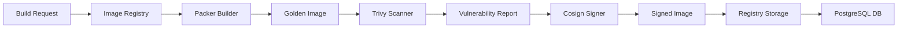

# QInfra Golden Image Pipeline

## Overview
The QInfra Golden Image Pipeline provides enterprise-grade infrastructure automation for building, scanning, signing, and deploying hardened golden images across multi-cloud environments.

## Architecture



## Components

### 1. Image Registry Service (Port 30096)
Central orchestrator for golden image lifecycle management.

**Features:**
- RESTful API for image operations
- Integration with all pipeline components
- PostgreSQL backend for persistent storage
- Multi-platform support (AWS, Azure, GCP, VMware)

**Endpoints:**
- `POST /images/build` - Initiate golden image build
- `GET /images` - List all golden images
- `POST /images/:id/scan` - Trigger vulnerability scan
- `POST /images/:id/sign` - Sign image with Cosign
- `GET /images/:id/patch-status` - Check patch requirements

### 2. Packer Builder (Port 30100)
Automated golden image building with hardening templates.

**Supported Templates:**
- Ubuntu 22.04 with CIS hardening
- RHEL 9 with STIG compliance
- Windows Server 2022 (coming soon)
- Custom templates via HCL

**Build Process:**
```bash
# Example build request
curl -X POST http://192.168.1.177:30096/images/build \
  -H "Content-Type: application/json" \
  -d '{
    "name": "ubuntu-production",
    "base_os": "ubuntu-22.04",
    "platform": "aws",
    "packages": ["nginx", "postgresql-client"],
    "hardening": "CIS",
    "compliance": ["SOC2", "HIPAA"]
  }'
```

### 3. Trivy Vulnerability Scanner (Port 30097)
Comprehensive security scanning for golden images.

**Capabilities:**
- CVE detection and reporting
- SBOM generation
- License compliance checking
- Secret detection
- Configuration drift analysis

**Integration:**
```go
// Automatic scanning after build
POST /images/{id}/scan
{
  "scan_type": "full",
  "include_sbom": true,
  "severity_threshold": "HIGH"
}
```

### 4. Cosign Image Signing (Port 30099)
Cryptographic signing for supply chain security.

**Features:**
- Keyless signing with OIDC
- Hardware security module support
- Admission webhook for verification
- Attestation storage

**Signing Flow:**
```bash
# Sign image
POST /images/{id}/sign

# Verify signature
cosign verify --key cosign.pub \
  docker-registry.image-registry.svc.cluster.local:5000/golden-images/ubuntu:latest
```

### 5. QInfra-AI Intelligence (Port 30098)
AI-powered predictive analytics and risk assessment.

**Intelligence Features:**
- Drift prediction with 85% accuracy
- Patch risk scoring
- Anomaly detection
- Compliance forecasting

## Complete Pipeline Workflow

### Step 1: Build Golden Image
```bash
# Create build request
BUILD_RESPONSE=$(curl -X POST http://192.168.1.177:30096/images/build \
  -H "Content-Type: application/json" \
  -d '{
    "name": "production-web-server",
    "base_os": "ubuntu-22.04",
    "platform": "aws",
    "packages": ["nginx", "fail2ban", "aide"],
    "hardening": "CIS",
    "compliance": ["SOC2", "HIPAA", "PCI-DSS"]
  }')

IMAGE_ID=$(echo $BUILD_RESPONSE | jq -r '.id')
```

### Step 2: Scan for Vulnerabilities
```bash
# Trigger vulnerability scan
SCAN_RESPONSE=$(curl -X POST \
  http://192.168.1.177:30096/images/$IMAGE_ID/scan)

# Check scan results
VULNERABILITIES=$(echo $SCAN_RESPONSE | jq '.vulnerabilities_found')
```

### Step 3: Sign Image
```bash
# Sign the golden image
SIGN_RESPONSE=$(curl -X POST \
  http://192.168.1.177:30096/images/$IMAGE_ID/sign)

# Verify signature
SIGNATURE=$(echo $SIGN_RESPONSE | jq -r '.attestation.signature')
```

### Step 4: Deploy to Production
```bash
# Get signed image details
IMAGE_DETAILS=$(curl http://192.168.1.177:30096/images/$IMAGE_ID)

# Deploy using signed image
REGISTRY_URL=$(echo $IMAGE_DETAILS | jq -r '.registry_url')
```

## Database Schema

The pipeline uses PostgreSQL for persistent storage:

```sql
-- Core tables
golden_images       -- Image metadata and configuration
vulnerabilities     -- CVE tracking per image
attestations       -- Signature and verification data
sbom               -- Software Bill of Materials
patch_status       -- Patch requirements tracking
build_history      -- Build logs and status
drift_reports      -- Drift detection results
```

## Security Compliance

### Supported Frameworks
- **CIS** - Center for Internet Security benchmarks
- **STIG** - Security Technical Implementation Guides
- **SOC2** - Service Organization Control 2
- **HIPAA** - Health Insurance Portability Act
- **PCI-DSS** - Payment Card Industry Data Security

### Hardening Features
- Kernel parameter tuning
- Network security configurations
- File system permissions
- Service minimization
- Audit logging
- Access controls

## Monitoring & Observability

### Metrics Endpoint
```bash
curl http://192.168.1.177:30096/metrics
```

### Health Checks
- Image Registry: `/health`
- Trivy Scanner: TCP port 8080
- Cosign Webhook: `/validate`
- Packer Builder: `/status`

### Logs
```bash
# View Image Registry logs
kubectl logs -n quantumlayer deployment/image-registry

# View Trivy Scanner logs  
kubectl logs -n trivy-system deployment/trivy

# View Packer Builder logs
kubectl logs -n packer-system statefulset/packer-builder
```

## Best Practices

1. **Regular Scanning**
   - Schedule daily vulnerability scans
   - Monitor CVE databases for new threats
   - Automate patch assessment

2. **Image Lifecycle**
   - Rebuild images monthly minimum
   - Deprecate images older than 90 days
   - Maintain version history

3. **Compliance Validation**
   - Run compliance checks before production
   - Document deviations and exceptions
   - Maintain audit trails

4. **Supply Chain Security**
   - Sign all production images
   - Verify signatures at deployment
   - Use admission controllers

## Troubleshooting

### Common Issues

1. **Build Failures**
   ```bash
   # Check Packer logs
   kubectl logs -n packer-system packer-builder-0 -c packer-builder
   ```

2. **Scan Timeouts**
   ```bash
   # Increase Trivy resources
   kubectl edit deployment -n trivy-system trivy
   ```

3. **Signature Verification Failed**
   ```bash
   # Check Cosign keys
   kubectl get secret -n cosign-system cosign-keys -o yaml
   ```

## API Reference

Full API documentation available at:
- Swagger UI: http://192.168.1.177:30096/swagger
- OpenAPI Spec: http://192.168.1.177:30096/openapi.json

## Next Steps

1. **Jenkins Integration** - Automated CI/CD pipeline
2. **HashiCorp Vault** - Dynamic secrets management
3. **Ansible Tower** - Configuration management
4. **Terraform Provider** - Infrastructure as Code
5. **Kubernetes Operators** - Automated operations

## Support

For issues or questions:
- GitHub: https://github.com/QuantumLayer-dev/quantumlayer-platform
- Documentation: https://docs.quantumlayer.dev
- Support: support@quantumlayer.dev