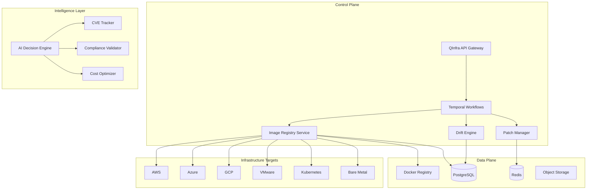
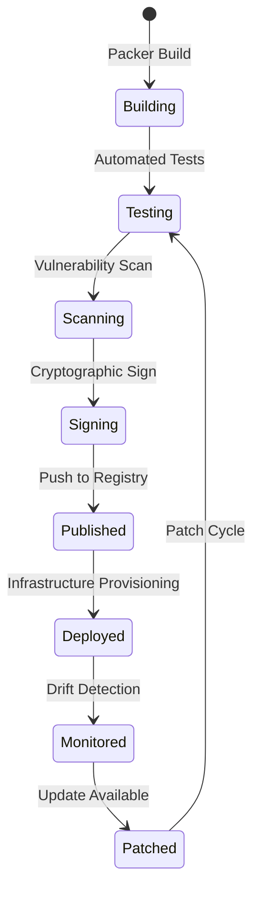

# QInfra - Enterprise Infrastructure Resilience Platform

## 📋 Table of Contents
- [Overview](#overview)
- [Architecture](#architecture)
- [Components](#components)
- [Getting Started](#getting-started)
- [API Reference](#api-reference)
- [Golden Images](#golden-images)
- [Patch Management](#patch-management)
- [Drift Detection](#drift-detection)
- [Compliance](#compliance)
- [Integration](#integration)
- [Roadmap](#roadmap)

## Overview

QInfra is QuantumLayer's enterprise infrastructure resilience platform that provides:

- **Golden Image Management**: Hardened, compliant base images for all platforms
- **Patch Intelligence**: Real-time CVE tracking and automated patching
- **Drift Detection**: Continuous monitoring for infrastructure deviations
- **Compliance Automation**: SOC2, HIPAA, PCI-DSS validation
- **Multi-Cloud Support**: AWS, Azure, GCP, VMware, Kubernetes, bare metal

### Key Features

✅ **Zero-Drift Infrastructure**: Ensure all systems match approved configurations  
✅ **Automated Compliance**: Continuous validation against security frameworks  
✅ **Universal Platform Support**: Single API for all infrastructure  
✅ **AI-Powered Intelligence**: Predictive patching and risk scoring  
✅ **Business Continuity**: Integrated DR and failover orchestration  

## Architecture



## Components

### 1. Golden Image Registry
Manages hardened, compliant base images across all platforms.

**Features:**
- Multi-platform image building (Packer integration)
- CIS/STIG hardening automation
- SBOM generation and tracking
- Cryptographic signing (Cosign/Notary)
- Vulnerability scanning (Trivy integration)

**Status:** ✅ Deployed

### 2. Patch Management Service
Intelligent patch orchestration with zero-downtime updates.

**Features:**
- Real-time CVE tracking (NVD, OSV APIs)
- Automated patch testing
- Canary deployments
- Rollback automation
- Compliance validation

**Status:** 🚧 In Development (Week 2)

### 3. Drift Detection Engine
Continuous monitoring for configuration deviations.

**Features:**
- Real-time drift detection
- Automated remediation
- Compliance reporting
- Historical tracking
- Root cause analysis

**Status:** 🚧 Planned (Week 2)

### 4. BCP/DR Orchestrator
Business continuity and disaster recovery automation.

**Features:**
- Automated DR drills
- RTO/RPO tracking
- Failover orchestration
- Recovery validation
- Runbook automation

**Status:** 📅 Planned (Week 4)

### 5. Unified Dashboard
Real-time visibility across all infrastructure.

**Features:**
- Golden image status matrix
- Patch compliance heatmap
- Drift visualization
- Executive KPIs
- Mobile responsive

**Status:** 📅 Planned (Week 3)

## Getting Started

### Prerequisites

- Kubernetes cluster (1.24+)
- 10GB storage for image registry
- PostgreSQL database
- Temporal cluster (optional)

### Quick Deploy

```bash
# 1. Deploy Docker Registry
kubectl apply -f infrastructure/kubernetes/docker-registry.yaml

# 2. Deploy Image Registry Service
kubectl apply -f infrastructure/kubernetes/image-registry-service.yaml

# 3. Verify deployment
kubectl get pods -n image-registry
kubectl get pods -n quantumlayer | grep image-registry

# 4. Test the service
curl http://<your-ip>:30096/health
```

### Building Golden Images

```bash
# Install Packer
brew install packer  # macOS
# or
sudo apt-get install packer  # Ubuntu

# Build Ubuntu 22.04 golden image
cd services/image-registry/packer
packer build ubuntu-golden.pkr.hcl

# Register with QInfra
curl -X POST http://localhost:30096/images/build \
  -H "Content-Type: application/json" \
  -d '{
    "name": "ubuntu-22.04-golden",
    "base_os": "ubuntu-22.04",
    "platform": "aws",
    "hardening": "CIS",
    "compliance": ["SOC2", "HIPAA"]
  }'
```

## API Reference

### Base URL
```
http://<your-cluster-ip>:30096
```

### Authentication
Currently using basic auth (production will use OAuth2/OIDC)

### Endpoints

#### Golden Image Management

##### Build Golden Image
```http
POST /images/build

Request:
{
  "name": "ubuntu-22.04-golden",
  "base_os": "ubuntu-22.04",
  "platform": "aws|azure|gcp|vmware|docker",
  "packages": ["nginx", "docker"],
  "hardening": "CIS|STIG|custom",
  "compliance": ["SOC2", "HIPAA", "PCI-DSS"],
  "metadata": {
    "team": "platform",
    "cost_center": "engineering"
  }
}

Response:
{
  "id": "uuid",
  "status": "building",
  "estimated_time": "10-15 minutes",
  "image": { ... }
}
```

##### List Golden Images
```http
GET /images

Response:
{
  "total": 10,
  "images": [
    {
      "id": "uuid",
      "name": "ubuntu-22.04-golden",
      "version": "1.0.0",
      "platform": "aws",
      "compliance": ["SOC2", "HIPAA"],
      "build_time": "2024-01-01T00:00:00Z"
    }
  ]
}
```

##### Scan Image for Vulnerabilities
```http
POST /images/{id}/scan

Response:
{
  "vulnerabilities_found": 5,
  "scan_time": "2024-01-01T00:00:00Z",
  "vulnerabilities": [
    {
      "cve": "CVE-2024-12345",
      "severity": "high",
      "description": "...",
      "fix_version": "1.0.1"
    }
  ]
}
```

##### Sign Golden Image
```http
POST /images/{id}/sign

Response:
{
  "status": "signed",
  "attestation": {
    "signature": "sha256:...",
    "signed_by": "quantumlayer-ca",
    "signed_at": "2024-01-01T00:00:00Z"
  }
}
```

#### Drift Detection

##### Detect Infrastructure Drift
```http
POST /drift/detect

Request:
{
  "platform": "aws",
  "datacenter": "us-east-1",
  "environment": "production"
}

Response:
{
  "total_nodes": 100,
  "drifted_nodes": 5,
  "details": [
    {
      "node_id": "node-001",
      "current_image": "ubuntu-20.04-v1.0.0",
      "expected_image": "ubuntu-20.04-v1.0.1",
      "drift_type": "version",
      "severity": "high"
    }
  ]
}
```

#### Platform Queries

##### Get Images by Platform
```http
GET /images/platform/{platform}

Response:
{
  "platform": "aws",
  "total": 5,
  "images": [ ... ]
}
```

##### Get Compliant Images
```http
GET /images/compliance/{framework}

Response:
{
  "framework": "SOC2",
  "total": 8,
  "images": [ ... ]
}
```

## Golden Images

### Supported Platforms

| Platform | Base OS | Hardening | Status |
|----------|---------|-----------|---------|
| AWS | Ubuntu, RHEL, Amazon Linux | CIS, STIG | ✅ Ready |
| Azure | Ubuntu, Windows Server | CIS | ✅ Ready |
| GCP | Ubuntu, CentOS | CIS | ✅ Ready |
| VMware | Ubuntu, RHEL, Windows | CIS, STIG | ✅ Ready |
| Docker | Alpine, Ubuntu | CIS | ✅ Ready |
| Kubernetes | Container images | CIS | ✅ Ready |

### Hardening Standards

#### CIS (Center for Internet Security)
- 200+ security controls
- Automated validation
- Compliance reporting
- Score: 95%+ required

#### STIG (Security Technical Implementation Guide)
- DoD security standards
- CAT I, II, III controls
- Automated remediation
- SCAP validation

### Image Lifecycle



## Patch Management

### CVE Tracking

QInfra continuously monitors:
- National Vulnerability Database (NVD)
- Open Source Vulnerability (OSV)
- Vendor security bulletins
- Zero-day disclosures

### Patch Workflow

1. **Detection**: CVE identified
2. **Assessment**: Risk scoring (CVSS)
3. **Testing**: Automated patch testing
4. **Approval**: Compliance validation
5. **Deployment**: Canary rollout
6. **Validation**: Post-patch verification

### Patch Policies

```yaml
policies:
  critical:
    sla: 24 hours
    approval: automatic
    rollout: immediate
    
  high:
    sla: 7 days
    approval: automatic
    rollout: canary
    
  medium:
    sla: 30 days
    approval: manual
    rollout: staged
    
  low:
    sla: 90 days
    approval: manual
    rollout: maintenance_window
```

## Drift Detection

### How It Works

1. **Baseline**: Golden image defines expected state
2. **Scanning**: Continuous comparison with actual state
3. **Detection**: Identify deviations
4. **Classification**: Categorize drift severity
5. **Remediation**: Automated or manual correction

### Drift Types

| Type | Description | Severity | Action |
|------|------------|----------|--------|
| Version | Package version mismatch | High | Auto-patch |
| Configuration | Config file changes | Medium | Alert |
| Permissions | File permission changes | High | Auto-fix |
| Services | Unauthorized services | Critical | Isolate |
| Users | Unauthorized users | Critical | Alert + Block |

### Remediation Options

- **Automatic**: Fix drift immediately
- **Scheduled**: Fix during maintenance window
- **Manual**: Alert for manual intervention
- **Ignore**: Accept drift with justification

## Compliance

### Supported Frameworks

#### SOC2 Type II
- Access controls
- Encryption requirements
- Audit logging
- Change management
- Incident response

#### HIPAA
- PHI protection
- Access controls
- Audit controls
- Integrity controls
- Transmission security

#### PCI-DSS
- Network segmentation
- Access control
- Vulnerability management
- Logging and monitoring
- Regular testing

### Compliance Scoring

```
Score = (Passed Controls / Total Controls) × 100

Thresholds:
- 95%+ : Compliant ✅
- 80-94% : Needs Improvement ⚠️
- <80% : Non-Compliant ❌
```

### Evidence Collection

QInfra automatically collects:
- Configuration snapshots
- Patch history
- Access logs
- Change records
- Scan results

## Integration

### Temporal Workflows

QInfra integrates with Temporal for orchestration:

```go
// Infrastructure workflow
func InfrastructureGenerationWorkflow(ctx workflow.Context, request InfraRequest) error {
    // Stage 1: Analyze requirements
    // Stage 2: Build golden image
    // Stage 3: Scan vulnerabilities
    // Stage 4: Sign image
    // Stage 5: Deploy infrastructure
    // Stage 6: Validate compliance
    // Stage 7: Monitor drift
}
```

### CI/CD Integration

#### GitLab CI
```yaml
stages:
  - build
  - scan
  - deploy

build-golden-image:
  stage: build
  script:
    - packer build golden-image.pkr.hcl
    - curl -X POST $QINFRA_API/images/build

scan-vulnerabilities:
  stage: scan
  script:
    - curl -X POST $QINFRA_API/images/$IMAGE_ID/scan
```

#### GitHub Actions
```yaml
name: Golden Image Pipeline
on:
  push:
    paths:
      - 'packer/**'

jobs:
  build:
    runs-on: ubuntu-latest
    steps:
      - uses: hashicorp/setup-packer@v1
      - run: packer build golden-image.pkr.hcl
      - run: |
          curl -X POST ${{ secrets.QINFRA_API }}/images/build
```

### Monitoring Integration

#### Prometheus Metrics
```prometheus
# Golden image metrics
qinfra_images_total{platform="aws"} 10
qinfra_images_compliant{framework="SOC2"} 8
qinfra_drift_percentage{environment="production"} 2.5
qinfra_vulnerabilities_critical{platform="aws"} 0
qinfra_patch_compliance_percentage 98.5
```

#### Grafana Dashboard
- Import dashboard ID: `qinfra-14789`
- Pre-configured panels for all metrics
- Real-time drift visualization
- Compliance tracking

## Roadmap

### Phase 1: Foundation (Week 1) ✅
- [x] Docker Registry deployment
- [x] Image Registry Service
- [x] Basic API implementation
- [x] CIS hardening scripts
- [x] Packer templates

### Phase 2: Intelligence (Week 2) 🚧
- [ ] CVE tracking service
- [ ] Patch orchestration
- [ ] Drift detection engine
- [ ] Automated remediation
- [ ] Risk scoring

### Phase 3: Visualization (Week 3) 📅
- [ ] React dashboard
- [ ] Real-time updates (WebSocket)
- [ ] Executive KPIs
- [ ] Compliance reports
- [ ] Mobile responsive

### Phase 4: Resilience (Week 4) 📅
- [ ] DR orchestration
- [ ] Automated drills
- [ ] RTO/RPO tracking
- [ ] Failover validation
- [ ] Recovery runbooks

### Phase 5: Enterprise (Month 2) 📅
- [ ] Multi-tenancy
- [ ] RBAC/SSO
- [ ] Audit logging
- [ ] Cost optimization
- [ ] White-label support

## Troubleshooting

### Common Issues

#### Registry Connection Failed
```bash
# Check registry status
kubectl get pods -n image-registry

# Check logs
kubectl logs -n image-registry docker-registry-xxx

# Test connectivity
curl http://localhost:30500/v2/
```

#### Image Build Failed
```bash
# Check Packer logs
packer build -debug ubuntu-golden.pkr.hcl

# Validate template
packer validate ubuntu-golden.pkr.hcl
```

#### Drift Detection Not Working
```bash
# Check service health
curl http://localhost:30096/health

# Check database connection
kubectl logs -n quantumlayer image-registry-xxx
```

## Support

### Documentation
- [API Reference](./API_REFERENCE.md)
- [Architecture Guide](./ARCHITECTURE.md)
- [Deployment Guide](./DEPLOYMENT.md)
- [Security Guide](./SECURITY.md)

### Community
- GitHub: [github.com/quantumlayer/qinfra](https://github.com/quantumlayer/qinfra)
- Discord: [discord.gg/quantumlayer](https://discord.gg/quantumlayer)
- Slack: [quantumlayer.slack.com](https://quantumlayer.slack.com)

### Enterprise Support
- Email: support@quantumlayer.io
- Phone: +1-800-QUANTUM
- SLA: 24/7 for Enterprise customers

---

**"Infrastructure that manages itself"** - QInfra Team