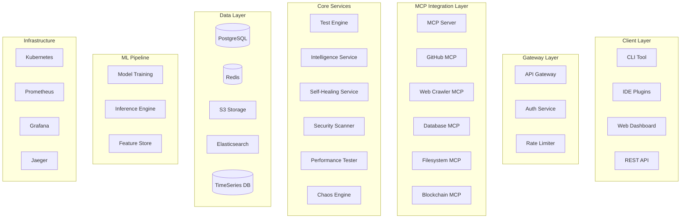

# QTest Technical Architecture

## System Design Document v1.0

---

## 🏗️ High-Level Architecture



---

## 🔧 Component Architecture

### 1. MCP Server Implementation

```go
// mcp/server.go
package mcp

import (
    "github.com/modelcontextprotocol/go-sdk"
    "github.com/quantumlayer/qtest/pkg/analyzer"
)

type MCPServer struct {
    config     *Config
    tools      map[string]Tool
    resources  map[string]Resource
    analyzer   *analyzer.CodeAnalyzer
}

type Tool interface {
    Name() string
    Description() string
    InputSchema() json.RawMessage
    Execute(input json.RawMessage) (json.RawMessage, error)
}

// GitHub Repository Reader Tool
type GitHubReaderTool struct {
    client *github.Client
    cache  *redis.Client
}

func (g *GitHubReaderTool) Execute(input json.RawMessage) (json.RawMessage, error) {
    var req GitHubRequest
    json.Unmarshal(input, &req)
    
    // Check cache
    if cached := g.checkCache(req.RepoURL); cached != nil {
        return cached, nil
    }
    
    // Clone repository
    repo := g.cloneRepo(req.RepoURL)
    
    // Analyze structure
    analysis := g.analyzeRepository(repo)
    
    // Cache results
    g.cacheResults(req.RepoURL, analysis)
    
    return json.Marshal(analysis)
}

// Web Crawler Tool
type WebCrawlerTool struct {
    playwright *playwright.Playwright
    analyzer   *DOMAnalyzer
}

func (w *WebCrawlerTool) Execute(input json.RawMessage) (json.RawMessage, error) {
    var req WebCrawlRequest
    json.Unmarshal(input, &req)
    
    // Launch browser
    browser := w.playwright.Launch()
    defer browser.Close()
    
    // Crawl website
    pages := w.crawlSite(browser, req.URL)
    
    // Extract user flows
    flows := w.analyzer.ExtractUserFlows(pages)
    
    return json.Marshal(flows)
}
```

### 2. Test Generation Engine

```typescript
// engine/testGenerator.ts
export class TestGenerator {
    private llmClient: LLMClient;
    private astParser: ASTParser;
    private coverageAnalyzer: CoverageAnalyzer;
    
    async generateTests(code: string, language: string): Promise<TestSuite> {
        // Parse AST
        const ast = await this.astParser.parse(code, language);
        
        // Extract testable units
        const units = this.extractTestableUnits(ast);
        
        // Generate test cases
        const tests = await Promise.all(
            units.map(unit => this.generateUnitTests(unit))
        );
        
        // Analyze coverage
        const coverage = await this.coverageAnalyzer.predict(code, tests);
        
        // Generate additional tests for uncovered code
        if (coverage.percentage < 80) {
            const additionalTests = await this.generateCoverageTests(
                coverage.uncovered
            );
            tests.push(...additionalTests);
        }
        
        return {
            tests,
            coverage,
            framework: this.selectFramework(language),
            setup: this.generateSetup(language),
            teardown: this.generateTeardown(language)
        };
    }
    
    private async generateUnitTests(unit: TestableUnit): Promise<TestCase> {
        const prompt = this.buildTestPrompt(unit);
        const response = await this.llmClient.generate(prompt);
        
        return {
            name: `test_${unit.name}`,
            code: response.code,
            assertions: this.extractAssertions(response),
            mocks: this.generateMocks(unit.dependencies),
            coverage: this.calculateCoverage(unit)
        };
    }
}
```

### 3. Self-Healing System

```python
# self_healing/healer.py
class SelfHealingEngine:
    def __init__(self):
        self.diff_analyzer = DiffAnalyzer()
        self.test_adapter = TestAdapter()
        self.confidence_scorer = ConfidenceScorer()
        
    async def heal_test(self, test: Test, old_code: str, new_code: str) -> HealedTest:
        # Analyze changes
        changes = self.diff_analyzer.analyze(old_code, new_code)
        
        # Map changes to test impacts
        impacts = self.map_test_impacts(test, changes)
        
        # Adapt test to changes
        healed_test = await self.adapt_test(test, impacts)
        
        # Calculate confidence
        confidence = self.confidence_scorer.score(
            test, healed_test, changes
        )
        
        # Validate healed test
        if confidence > 0.8:
            validation = await self.validate_test(healed_test, new_code)
            if validation.passes:
                return HealedTest(
                    test=healed_test,
                    confidence=confidence,
                    changes_addressed=changes
                )
        
        # Fallback to regeneration if confidence low
        return await self.regenerate_test(new_code)
    
    def adapt_test(self, test: Test, impacts: List[Impact]) -> Test:
        adapted = test.copy()
        
        for impact in impacts:
            if impact.type == ImpactType.ASSERTION:
                adapted.assertions = self.update_assertions(
                    adapted.assertions, impact
                )
            elif impact.type == ImpactType.MOCK:
                adapted.mocks = self.update_mocks(
                    adapted.mocks, impact
                )
            elif impact.type == ImpactType.SELECTOR:
                adapted.selectors = self.heal_selectors(
                    adapted.selectors, impact
                )
        
        return adapted
```

### 4. Security Testing Engine

```go
// security/scanner.go
package security

type SecurityScanner struct {
    owaspScanner   *OWASPScanner
    sqlInjector    *SQLInjectionTester
    xssDetector    *XSSDetector
    authTester     *AuthenticationTester
    cryptoAnalyzer *CryptoAnalyzer
}

func (s *SecurityScanner) GenerateSecurityTests(app Application) []SecurityTest {
    tests := []SecurityTest{}
    
    // OWASP Top 10
    tests = append(tests, s.owaspScanner.GenerateTests(app)...)
    
    // SQL Injection
    if app.HasDatabase {
        tests = append(tests, s.sqlInjector.GenerateTests(app)...)
    }
    
    // XSS
    if app.HasWebUI {
        tests = append(tests, s.xssDetector.GenerateTests(app)...)
    }
    
    // Authentication
    if app.HasAuth {
        tests = append(tests, s.authTester.GenerateTests(app)...)
    }
    
    // Cryptography
    if app.UsesCrypto {
        tests = append(tests, s.cryptoAnalyzer.GenerateTests(app)...)
    }
    
    return tests
}

// SQL Injection Testing
func (s *SQLInjectionTester) GenerateTests(app Application) []SecurityTest {
    payloads := []string{
        "' OR '1'='1",
        "'; DROP TABLE users--",
        "' UNION SELECT * FROM passwords--",
        "admin'--",
        "' OR 1=1--",
    }
    
    tests := []SecurityTest{}
    for _, endpoint := range app.Endpoints {
        for _, payload := range payloads {
            tests = append(tests, SecurityTest{
                Name:     fmt.Sprintf("SQLi_%s", endpoint.Name),
                Type:     "SQL_INJECTION",
                Endpoint: endpoint,
                Payload:  payload,
                Expected: "Should reject SQL injection attempt",
            })
        }
    }
    
    return tests
}
```

### 5. Performance Testing

```javascript
// performance/generator.js
class PerformanceTestGenerator {
    generateK6Script(api, config) {
        return `
import http from 'k6/http';
import { check, sleep } from 'k6';
import { Rate } from 'k6/metrics';

const errorRate = new Rate('errors');

export const options = {
    stages: [
        { duration: '2m', target: ${config.rampUpUsers} },
        { duration: '5m', target: ${config.targetUsers} },
        { duration: '2m', target: 0 },
    ],
    thresholds: {
        http_req_duration: ['p(95)<${config.maxLatency}'],
        errors: ['rate<${config.errorThreshold}'],
    },
};

export default function () {
    ${this.generateEndpointTests(api)}
    
    sleep(1);
}

${this.generateHelperFunctions()}
        `;
    }
    
    generateJMeterPlan(api, config) {
        return {
            testPlan: {
                name: `${api.name} Performance Test`,
                threadGroups: [{
                    name: "Main User Flow",
                    threads: config.targetUsers,
                    rampUp: config.rampUpTime,
                    duration: config.duration,
                    samplers: this.generateSamplers(api)
                }],
                listeners: [
                    "ViewResultsTree",
                    "SummaryReport",
                    "ResponseTimeGraph"
                ],
                assertions: this.generateAssertions(config)
            }
        };
    }
}
```

### 6. Chaos Engineering

```python
# chaos/engine.py
class ChaosEngine:
    def __init__(self):
        self.fault_injector = FaultInjector()
        self.network_chaos = NetworkChaos()
        self.resource_chaos = ResourceChaos()
        
    def generate_chaos_tests(self, system: System) -> List[ChaosTest]:
        tests = []
        
        # Service failures
        for service in system.services:
            tests.append(ChaosTest(
                name=f"kill_{service.name}",
                type="SERVICE_FAILURE",
                target=service,
                action=self.fault_injector.kill_service,
                expected_behavior="System remains available",
                recovery_time_sla=30  # seconds
            ))
        
        # Network chaos
        tests.append(ChaosTest(
            name="network_partition",
            type="NETWORK_PARTITION",
            action=self.network_chaos.partition_network,
            duration=60,
            expected_behavior="Split-brain handled gracefully"
        ))
        
        # Latency injection
        tests.append(ChaosTest(
            name="high_latency",
            type="LATENCY_INJECTION",
            action=lambda: self.network_chaos.add_latency(500),  # 500ms
            expected_behavior="Timeouts handled properly"
        ))
        
        # Resource exhaustion
        tests.append(ChaosTest(
            name="memory_pressure",
            type="RESOURCE_EXHAUSTION",
            action=lambda: self.resource_chaos.consume_memory(0.9),  # 90%
            expected_behavior="Graceful degradation"
        ))
        
        return tests
```

---

## 🗄️ Data Models

### Test Suite Schema

```sql
-- PostgreSQL Schema
CREATE TABLE test_suites (
    id UUID PRIMARY KEY DEFAULT gen_random_uuid(),
    workflow_id VARCHAR(255) NOT NULL,
    repository_url TEXT,
    website_url TEXT,
    language VARCHAR(50),
    framework VARCHAR(50),
    test_count INTEGER,
    coverage_percentage DECIMAL(5,2),
    created_at TIMESTAMP DEFAULT NOW(),
    updated_at TIMESTAMP DEFAULT NOW()
);

CREATE TABLE test_cases (
    id UUID PRIMARY KEY DEFAULT gen_random_uuid(),
    suite_id UUID REFERENCES test_suites(id),
    name VARCHAR(255),
    type VARCHAR(50), -- unit, integration, e2e, performance, security
    code TEXT,
    assertions JSONB,
    mocks JSONB,
    coverage DECIMAL(5,2),
    execution_time_ms INTEGER,
    last_result VARCHAR(50),
    created_at TIMESTAMP DEFAULT NOW()
);

CREATE TABLE test_executions (
    id UUID PRIMARY KEY DEFAULT gen_random_uuid(),
    test_case_id UUID REFERENCES test_cases(id),
    status VARCHAR(50), -- passed, failed, skipped
    duration_ms INTEGER,
    error_message TEXT,
    stack_trace TEXT,
    executed_at TIMESTAMP DEFAULT NOW()
);

CREATE TABLE self_healing_history (
    id UUID PRIMARY KEY DEFAULT gen_random_uuid(),
    test_case_id UUID REFERENCES test_cases(id),
    old_code TEXT,
    new_code TEXT,
    changes_detected JSONB,
    healing_confidence DECIMAL(3,2),
    auto_fixed BOOLEAN,
    created_at TIMESTAMP DEFAULT NOW()
);
```

### Redis Cache Structure

```yaml
# Cache Keys
repository:{repo_url}:
  structure: JSON
  files: JSON
  language: string
  ttl: 3600

website:{url}:
  pages: JSON
  flows: JSON
  selectors: JSON
  ttl: 1800

test_suite:{id}:
  tests: JSON
  coverage: JSON
  ttl: 86400

execution:{test_id}:
  result: JSON
  metrics: JSON
  ttl: 300
```

---

## 🔌 API Specification

### REST API Endpoints

```yaml
openapi: 3.0.0
info:
  title: QTest API
  version: 1.0.0

paths:
  /api/v1/test-github:
    post:
      summary: Generate tests for GitHub repository
      requestBody:
        content:
          application/json:
            schema:
              type: object
              properties:
                repository_url:
                  type: string
                  example: "https://github.com/facebook/react"
                output:
                  type: object
                  properties:
                    type:
                      type: string
                      enum: [new_repo, pull_request, download]
                    name:
                      type: string
                options:
                  type: object
                  properties:
                    coverage_target:
                      type: integer
                      minimum: 0
                      maximum: 100
                    test_types:
                      type: array
                      items:
                        type: string
                        enum: [unit, integration, e2e, security, performance]
      responses:
        200:
          description: Tests generated successfully
          content:
            application/json:
              schema:
                type: object
                properties:
                  suite_id:
                    type: string
                  test_count:
                    type: integer
                  coverage:
                    type: number
                  output_url:
                    type: string

  /api/v1/test-website:
    post:
      summary: Generate tests for live website
      requestBody:
        content:
          application/json:
            schema:
              type: object
              properties:
                url:
                  type: string
                  example: "https://amazon.com"
                test_types:
                  type: array
                  items:
                    type: string
                    enum: [e2e, visual, performance, accessibility, security]
                browser_targets:
                  type: array
                  items:
                    type: string
                    enum: [chrome, firefox, safari, edge]
      responses:
        200:
          description: Website tests generated

  /api/v1/heal:
    post:
      summary: Heal broken tests
      requestBody:
        content:
          application/json:
            schema:
              type: object
              properties:
                test_id:
                  type: string
                current_code:
                  type: string
                old_code:
                  type: string
                test_code:
                  type: string
                failure_message:
                  type: string
      responses:
        200:
          description: Test healed successfully

  /api/v1/monitor:
    post:
      summary: Setup production monitoring
      requestBody:
        content:
          application/json:
            schema:
              type: object
              properties:
                website_url:
                  type: string
                test_suite_id:
                  type: string
                frequency:
                  type: string
                  enum: [1m, 5m, 15m, 30m, 1h]
                alert_channels:
                  type: array
                  items:
                    type: string
                    enum: [email, slack, pagerduty, webhook]
      responses:
        200:
          description: Monitoring configured
```

---

## 🚀 Deployment Architecture

### Kubernetes Manifests

```yaml
# qtest-enhanced-deployment.yaml
apiVersion: apps/v1
kind: Deployment
metadata:
  name: qtest-engine
  namespace: quantumlayer
spec:
  replicas: 5
  selector:
    matchLabels:
      app: qtest-engine
  template:
    metadata:
      labels:
        app: qtest-engine
    spec:
      containers:
      - name: qtest
        image: ghcr.io/quantumlayer-dev/qtest:v2.0.0
        ports:
        - containerPort: 8091
        env:
        - name: MCP_ENABLED
          value: "true"
        - name: GITHUB_TOKEN
          valueFrom:
            secretKeyRef:
              name: github-credentials
              key: token
        resources:
          requests:
            memory: "1Gi"
            cpu: "500m"
          limits:
            memory: "2Gi"
            cpu: "1000m"
---
apiVersion: v1
kind: Service
metadata:
  name: qtest-engine
spec:
  selector:
    app: qtest-engine
  ports:
  - port: 80
    targetPort: 8091
---
apiVersion: autoscaling/v2
kind: HorizontalPodAutoscaler
metadata:
  name: qtest-hpa
spec:
  scaleTargetRef:
    apiVersion: apps/v1
    kind: Deployment
    name: qtest-engine
  minReplicas: 5
  maxReplicas: 50
  metrics:
  - type: Resource
    resource:
      name: cpu
      target:
        type: Utilization
        averageUtilization: 70
  - type: Resource
    resource:
      name: memory
      target:
        type: Utilization
        averageUtilization: 80
```

---

## 🔒 Security Considerations

### Authentication & Authorization

```typescript
// auth/middleware.ts
export class AuthMiddleware {
    async authenticate(req: Request): Promise<User> {
        const token = req.headers.authorization?.split(' ')[1];
        
        if (!token) {
            throw new UnauthorizedError('No token provided');
        }
        
        // Verify JWT
        const decoded = jwt.verify(token, process.env.JWT_SECRET);
        
        // Check permissions
        const user = await this.userService.findById(decoded.userId);
        
        if (!user.hasPermission('qtest.access')) {
            throw new ForbiddenError('Insufficient permissions');
        }
        
        // Rate limiting
        await this.rateLimiter.check(user.id, req.path);
        
        return user;
    }
}
```

### Data Protection

```python
# security/encryption.py
class DataProtection:
    def encrypt_sensitive_data(self, data: dict) -> dict:
        """Encrypt sensitive test data"""
        encrypted = {}
        
        for key, value in data.items():
            if self.is_sensitive(key):
                encrypted[key] = self.encrypt(value)
            else:
                encrypted[key] = value
        
        return encrypted
    
    def is_sensitive(self, key: str) -> bool:
        sensitive_patterns = [
            'password', 'secret', 'token', 'key',
            'credential', 'auth', 'private'
        ]
        return any(p in key.lower() for p in sensitive_patterns)
```

---

## 📊 Monitoring & Observability

### Metrics

```go
// metrics/collector.go
var (
    testsGenerated = prometheus.NewCounterVec(
        prometheus.CounterOpts{
            Name: "qtest_tests_generated_total",
            Help: "Total number of tests generated",
        },
        []string{"type", "language", "source"},
    )
    
    generationDuration = prometheus.NewHistogramVec(
        prometheus.HistogramOpts{
            Name: "qtest_generation_duration_seconds",
            Help: "Test generation duration",
            Buckets: prometheus.LinearBuckets(0, 5, 20),
        },
        []string{"type"},
    )
    
    healingSuccess = prometheus.NewCounterVec(
        prometheus.CounterOpts{
            Name: "qtest_healing_success_total",
            Help: "Successful test healings",
        },
        []string{"confidence_level"},
    )
)
```

### Logging

```python
# logging/structured.py
import structlog

logger = structlog.get_logger()

def log_test_generation(request_id: str, repo: str, stats: dict):
    logger.info(
        "test_generation_complete",
        request_id=request_id,
        repository=repo,
        test_count=stats["test_count"],
        coverage=stats["coverage"],
        duration_ms=stats["duration_ms"],
        language=stats["language"],
        framework=stats["framework"]
    )
```

---

## 🔄 CI/CD Pipeline

```yaml
# .github/workflows/qtest-deploy.yml
name: Deploy QTest

on:
  push:
    branches: [main]
    paths:
      - 'packages/qtest/**'

jobs:
  test:
    runs-on: ubuntu-latest
    steps:
    - uses: actions/checkout@v3
    - name: Run tests
      run: |
        cd packages/qtest
        go test ./...
    
  build:
    needs: test
    runs-on: ubuntu-latest
    steps:
    - uses: actions/checkout@v3
    - name: Build Docker image
      run: |
        docker build -t ghcr.io/quantumlayer-dev/qtest:${{ github.sha }} packages/qtest
    - name: Push to GHCR
      run: |
        echo ${{ secrets.GITHUB_TOKEN }} | docker login ghcr.io -u ${{ github.actor }} --password-stdin
        docker push ghcr.io/quantumlayer-dev/qtest:${{ github.sha }}
    
  deploy:
    needs: build
    runs-on: ubuntu-latest
    steps:
    - name: Deploy to Kubernetes
      run: |
        kubectl set image deployment/qtest-engine qtest=ghcr.io/quantumlayer-dev/qtest:${{ github.sha }} -n quantumlayer
```

---

## 🎯 Performance Targets

### SLAs

| Metric | Target | Current | Status |
|--------|--------|---------|--------|
| Test generation latency (p50) | <5s | - | ⬜ |
| Test generation latency (p99) | <30s | - | ⬜ |
| Coverage accuracy | >95% | - | ⬜ |
| Self-healing success rate | >90% | - | ⬜ |
| API availability | 99.9% | - | ⬜ |
| GitHub repo processing | <2min | - | ⬜ |
| Website crawling | <5min | - | ⬜ |

---

*Architecture Version: 1.0.0*
*Last Updated: September 4, 2025*