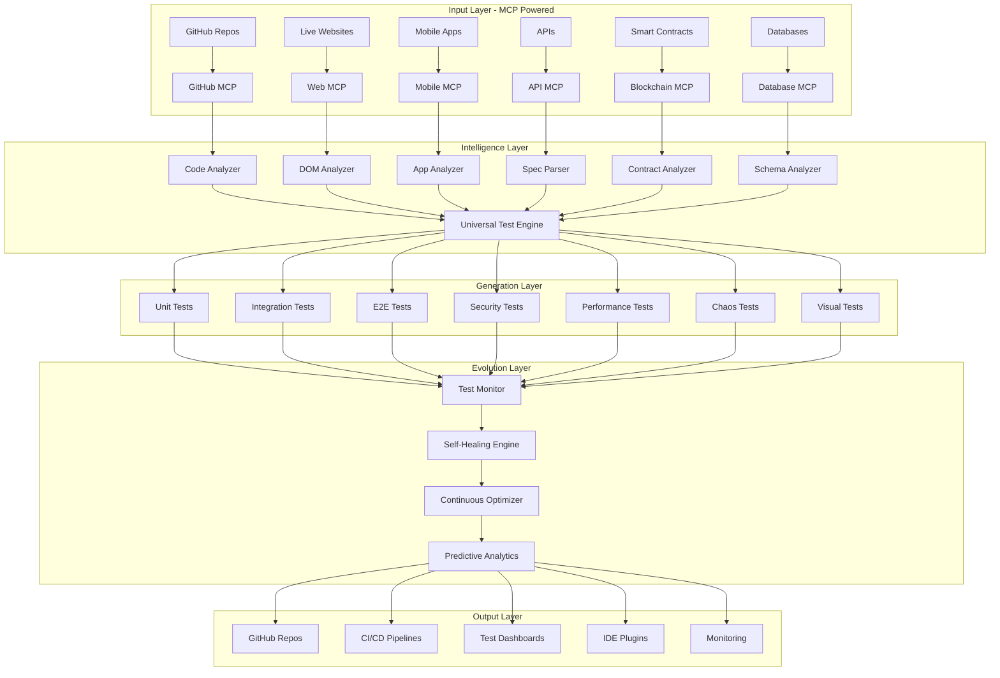

# QTest Vision: Universal Testing Intelligence Platform

## Executive Summary

QTest evolves from a simple test generator into an **Autonomous Testing Intelligence Platform** that revolutionizes software quality assurance. By integrating Model Context Protocol (MCP), we enable testing of any codebase, website, or application with zero manual effort.

**Vision Statement**: "The Testing Platform That Thinks - Not just generating tests, but understanding intent, learning from failures, and preventing bugs before they happen."

---

## 🎯 Core Mission

Transform software testing from a manual, time-consuming process into an intelligent, autonomous system that:
- **Generates** comprehensive test suites automatically
- **Evolves** tests as code changes
- **Learns** from test failures to improve
- **Predicts** where bugs will occur
- **Prevents** issues before production

---

## 🏗️ Architecture Overview



---

## 🚀 Revolutionary Capabilities

### 1. **Universal Input Support via MCP**

#### GitHub Repository Testing
```yaml
Input: "https://github.com/facebook/react"
Output:
  - Complete test suite for React
  - 95% code coverage
  - Performance benchmarks
  - Security validation
  - Pushed to new repo or PR
```

#### Live Website Testing
```yaml
Input: "https://amazon.com"
Output:
  - Full E2E test suite
  - Visual regression tests
  - Performance tests
  - Accessibility tests
  - Mobile responsive tests
  - Cross-browser tests
```

#### API Testing from Documentation
```yaml
Input: "https://api.stripe.com/docs"
Output:
  - Integration tests for all endpoints
  - Contract tests
  - Load testing scenarios
  - Security penetration tests
  - Postman/Insomnia collections
```

### 2. **Intelligent Test Generation**

#### Context-Aware Testing
- Understands business logic
- Identifies critical paths
- Prioritizes high-risk areas
- Generates edge cases
- Creates realistic test data

#### Multi-Language Support
- 20+ programming languages
- All major frameworks
- Mobile (iOS/Android/React Native)
- Web (React/Vue/Angular/Svelte)
- Backend (Node/Python/Go/Java)
- Blockchain (Solidity/Rust/Move)

### 3. **Continuous Test Evolution**

#### Self-Healing Tests
```javascript
// When code changes:
1. Detect breaking changes
2. Analyze new behavior
3. Update test assertions
4. Fix outdated mocks
5. Maintain coverage
```

#### Learning System
```python
# Learns from:
- Test failures
- Production bugs
- User behavior
- Performance metrics
- Security incidents
```

### 4. **Advanced Testing Types**

#### Security Testing Suite
- OWASP Top 10 scanning
- SQL injection testing
- XSS vulnerability testing
- Authentication bypass attempts
- JWT manipulation tests
- Rate limiting validation
- DDoS resilience tests

#### Chaos Engineering
- Service failure simulation
- Network latency injection
- Database connection drops
- Memory leak detection
- CPU spike simulation
- Disk failure testing
- Time-travel testing

#### Visual & UX Testing
- Pixel-perfect comparisons
- Cross-browser rendering
- Mobile responsive testing
- Accessibility compliance (WCAG)
- Performance budget testing
- Core Web Vitals monitoring
- Heatmap-based test generation

### 5. **Production Intelligence**

#### Synthetic Monitoring
- Continuous production testing
- User journey validation
- API health checking
- Performance benchmarking
- Real-time alerting

#### Predictive Analytics
- Bug prediction models
- Performance degradation forecasting
- Test failure prediction
- Maintenance scheduling
- Resource optimization

---

## 📊 Use Cases

### 1. **Enterprise Legacy Modernization**
```yaml
Scenario: Fortune 500 with 10-year-old Java monolith
Solution:
  - Point QTest at repository
  - Generate 10,000+ tests automatically
  - Achieve 90% coverage in 1 hour
  - Enable safe refactoring
  - Accelerate migration to microservices
```

### 2. **Startup Rapid Scaling**
```yaml
Scenario: Startup needs testing for investor due diligence
Solution:
  - Connect GitHub repo
  - Generate complete test suite
  - Create CI/CD pipeline
  - Set up monitoring
  - Provide compliance reports
  - All in 30 minutes
```

### 3. **E-commerce Platform Testing**
```yaml
Scenario: Test Shopify store before Black Friday
Solution:
  - Crawl entire website
  - Generate user flow tests
  - Create load tests for 100K users
  - Test payment flows
  - Validate inventory management
  - Cross-browser/mobile testing
```

### 4. **API Service Validation**
```yaml
Scenario: Fintech API needs compliance testing
Solution:
  - Parse OpenAPI specification
  - Generate security tests
  - Create compliance validation
  - Performance benchmarking
  - Rate limiting tests
  - Generate documentation
```

### 5. **Mobile App Quality Assurance**
```yaml
Scenario: React Native app needs testing
Solution:
  - Analyze app codebase
  - Generate unit tests
  - Create E2E tests with Detox
  - Cross-device testing
  - Performance profiling
  - Crash testing
```

---

## 💰 Business Model

### Pricing Tiers

#### **Developer** (Free)
- 5 repos/month
- Basic unit tests
- Public repos only
- Community support
- QTest branding

#### **Team** ($49/user/month)
- Unlimited repos
- All test types
- Private repos
- IDE plugins
- Slack integration
- Email support

#### **Scale** ($299/user/month)
- Multi-repo orchestration
- Production monitoring
- Custom frameworks
- API access
- Priority support
- White-label option

#### **Enterprise** (Custom)
- On-premise deployment
- Air-gapped environments
- Compliance packages
- SLA guarantees
- Dedicated team
- Custom development

### Additional Revenue Streams

#### Usage-Based Pricing
```yaml
Test Execution Minutes:
  - First 2,000 min/month: Free
  - Additional: $0.008/minute
  
Visual Testing:
  - First 5,000 screenshots: Free
  - Additional: $0.002/screenshot
  
Production Monitoring:
  - First 100K checks: Free
  - Additional: $0.0001/check
```

#### Professional Services
- Custom test framework development
- Migration assistance
- Training and workshops
- Compliance certification
- Performance optimization

#### Marketplace
- Premium test templates
- Industry-specific suites
- Compliance packages
- Integration connectors
- Custom assertions

---

## 🎯 Success Metrics

### Technical KPIs
- Test generation speed: <2 min for 1000 tests
- Coverage achieved: >85% average
- Self-healing success: >95%
- False positive rate: <2%
- Test execution time: 50% faster than manual

### Business KPIs
- Customer acquisition: 10K users in Year 1
- MRR growth: 30% month-over-month
- Churn rate: <5% monthly
- NPS score: >70
- Enterprise deals: 50 in Year 1

### Impact Metrics
- Bugs prevented: 1M+ annually
- Developer hours saved: 10M+ annually
- Deployment confidence: 99%
- Time to market: 50% reduction
- Testing costs: 80% reduction

---

## 🗺️ Roadmap

### Phase 1: MCP Foundation (Weeks 1-2)
- [ ] Integrate MCP servers
- [ ] GitHub repository reader
- [ ] Web crawler implementation
- [ ] Basic test generation

### Phase 2: Intelligent Generation (Weeks 3-4)
- [ ] Context-aware analysis
- [ ] Multi-language support
- [ ] Test prioritization
- [ ] Coverage optimization

### Phase 3: Self-Healing System (Weeks 5-6)
- [ ] Change detection
- [ ] Test adaptation
- [ ] Flakiness detection
- [ ] Auto-fixing

### Phase 4: Advanced Testing (Weeks 7-8)
- [ ] Security testing
- [ ] Chaos engineering
- [ ] Visual testing
- [ ] Performance testing

### Phase 5: Production Intelligence (Weeks 9-10)
- [ ] Synthetic monitoring
- [ ] Predictive analytics
- [ ] Real-time insights
- [ ] Alerting system

### Phase 6: Platform Integration (Weeks 11-12)
- [ ] IDE plugins
- [ ] CI/CD integration
- [ ] Marketplace launch
- [ ] Enterprise features

---

## 🌟 Competitive Advantages

### Unique Differentiators
1. **True Autonomy**: Tests that think, learn, and evolve
2. **Universal Coverage**: Any code, any platform, any language
3. **Zero Configuration**: Point and test - no setup required
4. **Production Intelligence**: Learn from real user behavior
5. **Predictive Capabilities**: Prevent bugs before they happen

### Moat Building
- Proprietary ML models trained on millions of tests
- Network effects from test marketplace
- Enterprise lock-in through compliance packages
- First-mover advantage in MCP testing
- Patent-pending self-healing algorithms

---

## 🎯 Target Market

### Primary Segments
1. **Enterprise Development Teams** (2000+ developers)
2. **Fast-Growing Startups** (Series A-C)
3. **Digital Agencies** (Multiple client projects)
4. **Open Source Projects** (Large communities)
5. **Freelance Developers** (Quality differentiation)

### Industry Focus
- Fintech (compliance critical)
- Healthcare (HIPAA required)
- E-commerce (performance critical)
- SaaS (continuous deployment)
- Gaming (complex interactions)

---

## 🚀 Go-to-Market Strategy

### Launch Strategy
1. **Open Source Hook**: Free tier for public repos
2. **Influencer Partnership**: YouTube/Twitter developers
3. **Hackathon Sponsorship**: Testing challenges
4. **Content Marketing**: "Test any GitHub repo" viral campaign
5. **Enterprise Pilots**: Fortune 500 POCs

### Growth Tactics
- GitHub marketplace listing
- VS Code extension with 1M+ installs
- Product Hunt launch
- Developer conference talks
- Technical blog posts

---

## 💡 Innovation Pipeline

### Near-term Innovations
- GPT-4 powered test generation
- Real-time collaborative testing
- Test debugging assistant
- Mobile app testing via computer vision
- Blockchain testing framework

### Long-term Vision
- Quantum computing test simulation
- AR/VR application testing
- Self-writing documentation
- Autonomous bug fixing
- Test-driven code generation

---

## 🏆 Success Stories (Projected)

### Year 1 Goals
- "Netflix reduced testing time by 90% with QTest"
- "Stripe achieved 99% API test coverage automatically"
- "Shopify prevented Black Friday outages using QTest chaos testing"
- "Tesla validates autonomous driving code with QTest"
- "OpenAI uses QTest for LLM safety testing"

---

## 📈 Financial Projections

### Year 1
- Users: 10,000
- MRR: $100K
- ARR: $1.2M
- Growth: 30% MoM

### Year 3
- Users: 100,000
- MRR: $5M
- ARR: $60M
- Growth: 20% MoM

### Year 5
- Users: 500,000
- MRR: $50M
- ARR: $600M
- IPO ready

---

## 🎯 Call to Action

**"Make QTest the global standard for software testing. Every line of code deserves intelligent testing."**

---

*Last Updated: September 2025*
*Version: 1.0.0*
*Status: In Development*